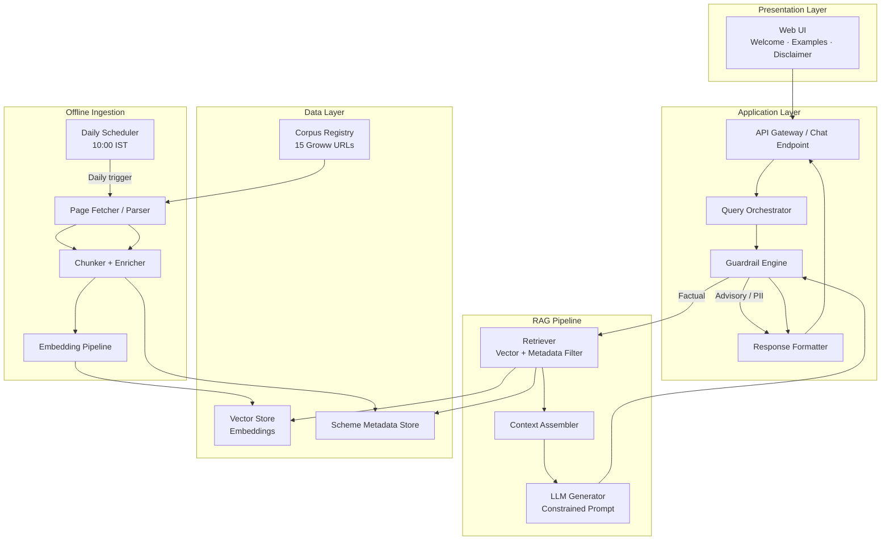
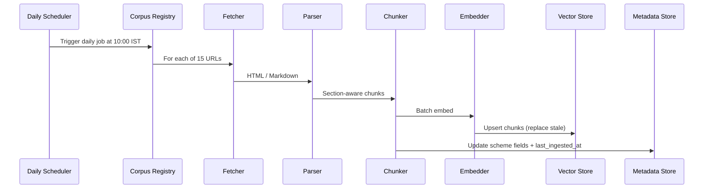
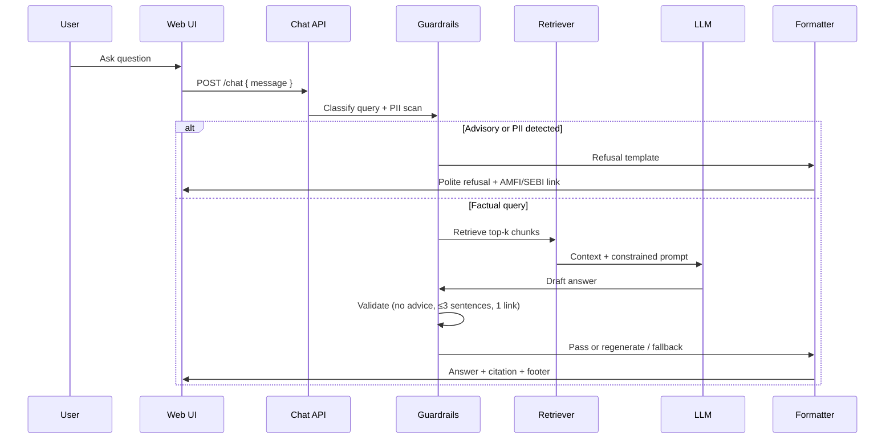
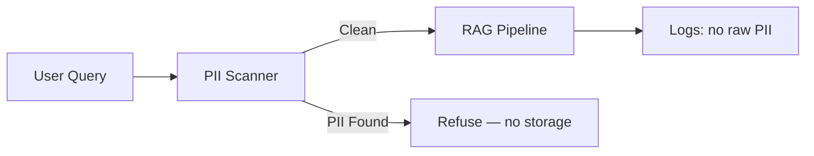
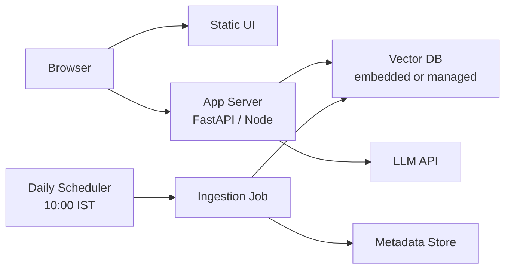

# Architecture: Mutual Fund FAQ Assistant (Facts-Only Q&A)

This document describes the technical architecture for a lightweight, compliance-first Retrieval-Augmented Generation (RAG) assistant that answers factual questions about Tata Mutual Fund schemes using a curated corpus of 15 Groww scheme pages. It is derived from [ProblemStatement.md](./ProblemStatement.md).

---

## 1. Design Principles

| Principle | Description |
|-----------|-------------|
| **Facts-only** | Answer verifiable scheme attributes only; never recommend, compare, or opine. |
| **Source-backed** | Every factual answer cites exactly one corpus URL and includes a last-updated footer. |
| **Accuracy over fluency** | Prefer retrieved text and structured fields over model creativity. |
| **Minimal surface area** | Small corpus, simple UI, no user PII collection. |
| **Fail-safe refusals** | Advisory or out-of-scope queries are blocked before or after generation. |
| **Daily freshness** | A scheduler re-runs ingestion every day at **10:00 IST** so scheme data and the `Last updated from sources` footer reflect the latest corpus content. |

---

## 2. High-Level Architecture



### Component Summary

| Layer | Responsibility |
|-------|----------------|
| **Presentation** | Chat UI with welcome message, three example questions, and persistent disclaimer. |
| **Application** | Route queries, enforce guardrails, orchestrate RAG, format compliant responses. |
| **RAG** | Retrieve relevant chunks, assemble context, generate bounded answers. |
| **Data** | Store embeddings, scheme metadata, and corpus URL registry. |
| **Offline Ingestion** | Fetch, parse, chunk, embed, and index the 15 scheme pages. |
| **Daily Scheduler** | Triggers the ingestion pipeline once per day at **10:00 IST** to refresh corpus data, embeddings, and metadata. |

---

## 3. Corpus & Data Model

### 3.1 Corpus Registry

The corpus is a fixed list of 15 Tata Mutual Fund scheme pages on Groww. Each entry is immutable at runtime and defined in configuration:

```json
{
  "amc": "Tata Mutual Fund",
  "scheme_id": "tata-elss-fund-direct-growth",
  "scheme_name": "Tata ELSS Fund Direct Growth",
  "source_url": "https://groww.in/mutual-funds/tata-elss-fund-direct-growth",
  "category": "ELSS",
  "last_ingested_at": "2027-06-18T00:00:00Z"
}
```

### 3.2 Document Chunk Schema

Each indexed chunk carries metadata for filtering and citation:

| Field | Purpose |
|-------|---------|
| `chunk_id` | Unique identifier |
| `scheme_id` | Links chunk to one scheme |
| `source_url` | Canonical citation URL (always the Groww scheme page) |
| `section` | e.g. `expense_ratio`, `exit_load`, `min_sip`, `riskometer`, `benchmark`, `fund_manager` |
| `content` | Normalized text from the page |
| `extracted_at` | Ingestion timestamp for footer date |
| `embedding` | Vector representation |

### 3.3 Structured Metadata (Optional Enhancement)

For high-confidence factual fields, extract structured key-value pairs during ingestion (e.g. `expense_ratio: 0.21%`, `min_sip: ₹150`). The retriever can short-circuit to structured lookup when the query intent maps cleanly to a known field, reducing hallucination risk.

---

## 4. Offline Ingestion Pipeline

Ingestion runs as a batch job triggered by a **daily scheduler at 10:00 IST** (`Asia/Kolkata`), not on every user query. The scheduler ensures scheme facts (expense ratio, exit load, minimum SIP, NAV-related text, fund managers, etc.) stay current by re-fetching all 15 Groww pages, re-parsing content, and updating the vector store and metadata every day.



### 4.0 Daily Ingestion Scheduler

| Aspect | Detail |
|--------|--------|
| **Purpose** | Keep the RAG corpus aligned with the latest Groww scheme page data |
| **Frequency** | Once every day (24-hour cycle) |
| **Schedule** | **10:00 IST** (`Asia/Kolkata`) |
| **Trigger** | Automated scheduler; no manual or user-initiated refresh required for normal operation |
| **Scope** | All 15 URLs in the corpus registry |
| **Outcome** | Updated raw snapshots, chunks, embeddings, structured metadata, and `last_ingested_at` timestamps |

**Scheduler responsibilities:**

1. Fire the ingestion job daily at **10:00 IST** (cron: `0 10 * * *` with `TZ=Asia/Kolkata`; equivalent **04:30 UTC** if the host clock is UTC-only).
2. Invoke `ingest_corpus.py` (or equivalent orchestration entrypoint).
3. Log run status: start time, end time, schemes succeeded/failed, and new `last_ingested_at`.
4. On partial failure, retry failed URLs once; alert if any scheme remains stale.
5. Publish the latest ingestion date so the response formatter can populate `Last updated from sources: <date>`.

**Implementation options:**

| Environment | Scheduler mechanism |
|-------------|---------------------|
| **Local / dev** | OS cron, Windows Task Scheduler, or `APScheduler` inside a worker process |
| **Docker** | Sidecar cron container or `ofelia` job calling the ingest script |
| **Cloud** | AWS EventBridge + Lambda, GCP Cloud Scheduler, Azure Logic Apps, or Kubernetes `CronJob` |

The chat API remains read-only between scheduled runs; users always query the most recently completed daily index without waiting for live fetches.

**Manual override:** `POST /api/ingest` (admin-only) remains available for on-demand re-index outside the daily window (e.g. debugging or emergency refresh).

### 4.1 Fetching

- Read from pre-saved markdown snapshots (uploaded corpus files) or fetch live Groww pages.
- Respect `robots.txt` and rate limits when fetching live.
- Store raw content versioned by `ingested_at` for auditability.

### 4.2 Parsing & Normalization

Extract sections aligned with FAQ intents:

- Expense ratio, exit load, stamp duty, tax implications
- Minimum SIP / lumpsum amounts
- Riskometer and category
- Benchmark index and investment objective
- Fund manager names and tenure
- ELSS lock-in (scheme-specific, e.g. Tata ELSS)

Strip navigation, ads, and unrelated page chrome. Normalize currency (`₹`) and percentages consistently.

### 4.3 Chunking Strategy

| Strategy | Rationale |
|----------|-----------|
| **Section-based splitting** | Keeps exit load, tax, and SIP rules in coherent chunks. |
| **Small chunk size (300–500 tokens)** | Improves precision for narrow factual queries. |
| **Overlap (50–80 tokens)** | Preserves context at section boundaries. |
| **One scheme per metadata filter** | Enables scheme-scoped retrieval. |

### 4.4 Embedding & Indexing

- Use a lightweight embedding model (e.g. `text-embedding-3-small`, `all-MiniLM-L6-v2`).
- Index in a local vector store (Chroma, FAISS, or LanceDB) suitable for a 15-document corpus.
- **Daily re-index:** the scheduler replaces or upserts chunks and embeddings after each successful run so retrieval always reflects the latest ingested content.
- No incremental user-triggered indexing during normal chat flow.

### 4.5 Post-Ingestion Data Refresh Flow

After each daily run completes:

1. **Vector store** — old chunks for each scheme are replaced with newly embedded content.
2. **Metadata store** — structured fields (`expense_ratio`, `min_sip`, `exit_load`, etc.) and `last_ingested_at` are updated per scheme.
3. **Corpus registry** — `last_ingested_at` is written for each of the 15 entries.
4. **Response footer** — `Last updated from sources: <date>` uses the global or per-scheme ingestion timestamp from the latest successful run.

If a daily run fails entirely, the system continues serving the last successful index and logs a staleness warning; the scheduler retries on the next day’s cycle.

---

## 5. Online Query Flow



### 5.1 Query Orchestrator Steps

1. **Normalize** user input (trim, lowercase for classification only).
2. **Detect scheme** from explicit name or alias map (e.g. "ELSS" → Tata ELSS Fund).
3. **Classify intent** (factual vs advisory vs performance-comparison vs out-of-scope).
4. **Retrieve** top-k chunks (k = 3–5), filtered by `scheme_id` when resolved.
5. **Generate** answer with strict prompt constraints.
6. **Validate** output; retry once or fall back to template if validation fails.
7. **Format** final response with citation and footer.

---

## 6. Guardrail Engine

The guardrail layer is the compliance backbone. It runs **before** retrieval (input) and **after** generation (output).

### 6.1 Input Classification

| Class | Examples | Action |
|-------|----------|--------|
| **Factual** | "What is the expense ratio of Tata ELSS?" | Proceed to RAG |
| **Advisory** | "Should I invest in this fund?" | Refuse |
| **Comparative** | "Which fund is better?" | Refuse |
| **Performance** | "What returns did it give last year?" | No calculation; link to scheme page only |
| **PII** | Contains PAN, Aadhaar, account, OTP, email, phone | Refuse + do not log payload |
| **Out-of-corpus** | Scheme not in the 15 URLs | Clarify scope or refuse |

Implementation options (can be combined):

- **Rule-based patterns** for advisory phrases (`should I`, `better`, `recommend`, `buy or sell`).
- **Lightweight classifier** (keyword + small LLM yes/no) for edge cases.
- **PII regex** for Indian identifiers and contact patterns.

### 6.2 Output Validation

Generated answers must pass all checks:

- [ ] Maximum 3 sentences
- [ ] Exactly one URL, and it must be from the corpus registry
- [ ] No advice, recommendations, or superiority language
- [ ] No return calculations or fund-vs-fund comparisons
- [ ] Footer present: `Last updated from sources: <date>`

On failure: regenerate with stricter prompt, or return a safe fallback:

> I can only share verified facts from official scheme sources. Please see the scheme page for details: \<corpus URL\>

### 6.3 Refusal Response Template

Refusals are polite, restate the facts-only policy, and include one educational link:

> I'm a facts-only assistant and cannot provide investment advice or compare funds. For general investor education, see [AMFI Investor Corner](https://www.amfiindia.com/investor-corner) or [SEBI Investor Education](https://investor.sebi.gov.in/).

(Exact URLs should be verified at implementation time.)

---

## 7. RAG Generation Layer

### 7.1 Retrieval

```
query_embedding = embed(user_question)
candidates = vector_store.similarity_search(
    query_embedding,
    k=5,
    filter={ scheme_id: resolved_scheme }  # optional
)
context = merge_top_chunks(candidates, max_tokens=1500)
```

For scheme-specific questions without a named scheme, return a clarifying prompt in the UI rather than guessing.

### 7.2 Constrained System Prompt (Summary)

The LLM receives:

- Role: facts-only Tata Mutual Fund FAQ assistant
- Allowed: answer only from provided context
- Forbidden: advice, opinions, comparisons, return math, external URLs
- Format: ≤3 sentences, one citation URL from context metadata, footer date from `extracted_at`

### 7.3 Model Selection

Prefer a small, fast model (e.g. GPT-4o-mini, Claude Haiku, or local Llama 3.x) because creativity is undesirable. Temperature should be low (0–0.2).

---

## 8. Response Formatter

All responses share a consistent structure:

```text
<Answer body — max 3 sentences>

Source: https://groww.in/mutual-funds/<scheme-slug>

Last updated from sources: 18 Jun 2027
```

| Response Type | Citation Source |
|---------------|-----------------|
| Factual answer | Matching Groww scheme page from corpus |
| Performance query | Scheme page link only (no computed returns) |
| Refusal | AMFI or SEBI educational URL |

The formatter enforces URL allowlisting against the corpus registry and educational link list.

---

## 9. User Interface Architecture

### 9.1 Layout

```
┌─────────────────────────────────────────────────┐
│  Mutual Fund FAQ Assistant                      │
│  Facts-only. No investment advice.              │
├─────────────────────────────────────────────────┤
│  Welcome! Ask factual questions about 15        │
│  Tata Mutual Fund schemes on Groww.             │
│                                                 │
│  Try:                                           │
│  • What is the minimum SIP for Tata ELSS?       │
│  • What is the exit load on Tata Silver ETF FoF?│
│  • Who manages the Tata Flexi Cap Fund?         │
├─────────────────────────────────────────────────┤
│  [ Chat messages ]                              │
├─────────────────────────────────────────────────┤
│  [ Ask a question...                    ] [→] │
└─────────────────────────────────────────────────┘
```

### 9.2 UI Requirements Mapping

| Requirement | Implementation |
|-------------|----------------|
| Welcome message | Static copy on first load |
| Three example questions | Clickable chips that populate the input |
| Disclaimer | Persistent banner or subtitle |
| No PII collection | No login, no form fields for personal data |

### 9.3 Frontend Stack (Suggested)

- **React / Next.js** or **Streamlit** for rapid prototyping
- Single `POST /api/chat` integration
- Markdown-safe rendering for links; sanitize all HTML

---

## 10. API Design

### `POST /api/chat`

**Request**

```json
{
  "message": "What is the expense ratio of Tata Large Cap Fund Direct Growth?"
}
```

**Response — factual**

```json
{
  "type": "answer",
  "message": "The expense ratio of Tata Large Cap Fund Direct Growth is 0.29%. This is the annual fee charged by the fund house for managing the scheme.\n\nSource: https://groww.in/mutual-funds/tata-large-cap-fund-direct-growth\n\nLast updated from sources: 18 Jun 2027",
  "citation_url": "https://groww.in/mutual-funds/tata-large-cap-fund-direct-growth",
  "scheme_id": "tata-large-cap-fund-direct-growth"
}
```

**Response — refusal**

```json
{
  "type": "refusal",
  "message": "I'm a facts-only assistant and cannot provide investment advice...",
  "citation_url": "https://www.amfiindia.com/investor-corner",
  "reason": "advisory"
}
```

### Additional Endpoints (Optional)

| Endpoint | Purpose |
|----------|---------|
| `GET /api/schemes` | List the 15 schemes for UI autocomplete |
| `GET /api/health` | Liveness check |
| `POST /api/ingest` | Admin-only on-demand re-index (protected); daily refresh is handled by the scheduler |

---

## 11. Privacy & Security



| Control | Implementation |
|---------|----------------|
| **No PII storage** | Do not persist PAN, Aadhaar, accounts, OTPs, email, or phone |
| **PII rejection** | Block at input; do not forward to LLM or logs |
| **Minimal logging** | Log intent class and scheme_id only; avoid full message retention or use redaction |
| **No authentication** | Public read-only FAQ; no user accounts in v1 |
| **URL allowlisting** | Prevent citation injection via prompt output |
| **Rate limiting** | Basic per-IP throttling on `/api/chat` |

---

## 12. Suggested Project Structure

```
mutual-fund-faq-assistant/
├── app/
│   ├── api/
│   │   └── chat.py              # Chat endpoint
│   ├── core/
│   │   ├── guardrails.py        # Input/output compliance
│   │   ├── retriever.py         # Vector search + metadata filter
│   │   ├── generator.py         # LLM calls with constrained prompts
│   │   └── formatter.py         # Citation + footer enforcement
│   ├── ingestion/
│   │   ├── fetcher.py
│   │   ├── parser.py
│   │   ├── chunker.py
│   │   └── embed_index.py
│   └── ui/                      # Web frontend
├── data/
│   ├── corpus_registry.json     # 15 URLs + scheme metadata
│   ├── raw/                     # Saved page snapshots
│   └── vector_store/            # Local embedding index
├── config/
│   └── settings.py
├── scheduler/
│   ├── daily_ingest_job.py        # Entrypoint invoked by the scheduler
│   └── cron.yaml                  # Daily at 10:00 IST (Asia/Kolkata)
├── scripts/
│   └── ingest_corpus.py           # Shared ingestion logic (also used by scheduler)
├── tests/
│   ├── test_guardrails.py
│   ├── test_retrieval.py
│   └── test_response_format.py
├── Docs folder/
│   ├── ProblemStatement.md
│   └── architecture.md
└── README.md
```

---

## 13. Deployment Topology

### 13.1 Development

- Local vector store on disk
- LLM via API key (OpenAI / Anthropic) or local Ollama
- `streamlit run` or `npm run dev` for UI

### 13.2 Production (Lightweight)



- Containerize API + vector index (updated daily by the scheduler)
- **Daily scheduler** triggers the full ingestion pipeline once per day at **10:00 IST** to fetch latest Groww data and refresh embeddings
- Chat API reads from the last successful daily index; no live scrape on user requests
- Environment variables for API keys; no secrets in repo

---

## 14. Testing Strategy

| Test Type | Focus |
|-----------|-------|
| **Unit** | PII regex, advisory keyword detection, sentence/link counting |
| **Integration** | Retrieval returns correct scheme chunks for sample queries |
| **Golden-set QA** | 30–50 factual questions with expected fields and citation URLs |
| **Refusal suite** | Advisory/comparison queries always refuse |
| **Regression** | Response format always includes footer and single link |
| **Scheduler** | Daily job at 10:00 IST completes for all 15 URLs; `last_ingested_at` updates; vector store reflects new content |

Example golden questions:

- "What is the minimum SIP for Tata ELSS Fund Direct Growth?"
- "What is the exit load on Tata Arbitrage Fund?"
- "What is the benchmark for Tata BSE Sensex Index Direct?"
- "Should I invest in Tata Small Cap?" → must refuse

---

## 15. Known Limitations

| Limitation | Mitigation |
|------------|------------|
| Corpus limited to 15 Groww pages | Document scope clearly in UI; suggest scheme from list |
| Groww data may lag AMC factsheets | Show `Last updated from sources` footer; daily scheduler re-ingestion |
| No live NAV or performance calculations | Redirect performance questions to scheme page link only |
| Scheme disambiguation | Prompt user when multiple schemes match |
| Markdown snapshots vs live HTML | Daily scheduler fetches live pages; version by `last_ingested_at` |
| LLM may still hallucinate | Retrieval-first + output validation + structured field lookup |

---

## 16. Success Criteria Traceability

| Success Criterion (Problem Statement) | Architectural Mechanism |
|---------------------------------------|-------------------------|
| Accurate factual retrieval | Section-aware chunking + scheme metadata filters + daily scheduler refresh |
| Facts-only responses | Guardrail engine (input + output) |
| Valid source citations | URL allowlist + response formatter |
| Proper advisory refusal | Advisory/comparison classifier + refusal templates |
| Clean minimal UI | Single-page chat with examples and disclaimer |

---

## 17. Implementation Phases

| Phase | Deliverable |
|-------|-------------|
| **Phase 1 — Corpus** | Registry JSON, ingestion script, daily scheduler, vector index from 15 pages |
| **Phase 2 — RAG Core** | Retriever, generator, formatter, `/api/chat` |
| **Phase 3 — Guardrails** | PII scan, advisory refusal, output validation |
| **Phase 4 — UI** | Welcome, example questions, disclaimer, chat |
| **Phase 5 — Hardening** | Golden tests, rate limits, README, scheduler monitoring and re-ingestion runbooks |

---

## 18. References

- [ProblemStatement.md](./ProblemStatement.md) — requirements, corpus URLs, constraints
- [AMFI Investor Corner](https://www.amfiindia.com/investor-corner) — educational link for refusals
- [SEBI Investor Education](https://investor.sebi.gov.in/) — educational link for refusals
