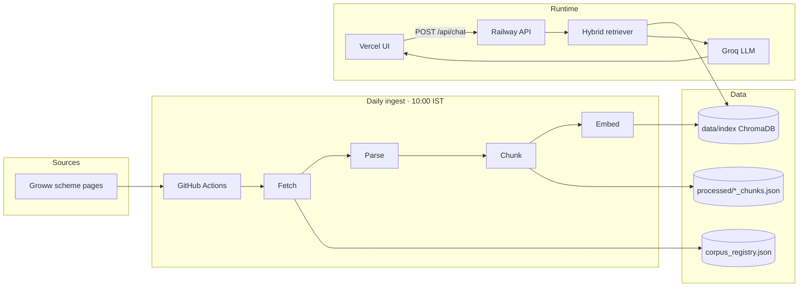
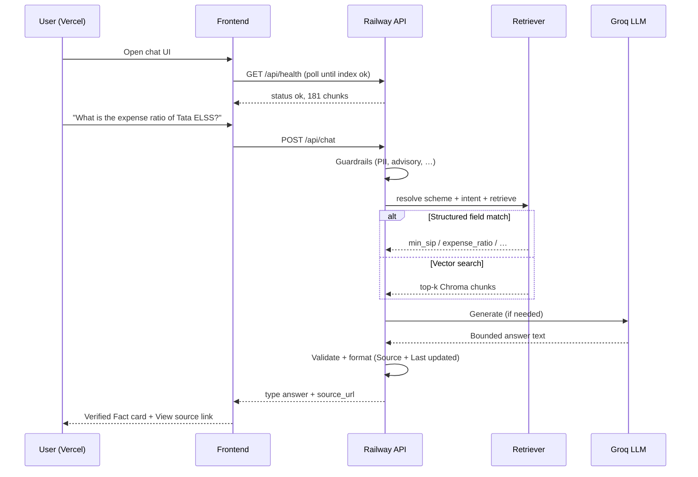

# Mutual Fund FAQ Assistant — End-to-End Project Guide

**Facts-only RAG chat assistant for 15 Tata Mutual Fund schemes on Groww.**

> Facts-only. No investment advice.

---

## Live deployment


| Service                | URL                                                                                                              | Platform                       |
| ---------------------- | ---------------------------------------------------------------------------------------------------------------- | ------------------------------ |
| **Chat UI**            | [https://tata-mutual-fund-faq.vercel.app](https://tata-mutual-fund-faq.vercel.app)                               | [Vercel](https://vercel.com)   |
| **API**                | [https://tata-mutual-fund-faq-production.up.railway.app](https://tata-mutual-fund-faq-production.up.railway.app) | [Railway](https://railway.app) |
| **Health check**       | [GET /api/health](https://tata-mutual-fund-faq-production.up.railway.app/api/health)                             | —                              |
| **API docs (Swagger)** | [GET /docs](https://tata-mutual-fund-faq-production.up.railway.app/docs)                                         | FastAPI                        |
| **Source code**        | [github.com/SayaliAsole26/TATA-mutual-fund-FAQ](https://github.com/SayaliAsole26/TATA-mutual-fund-FAQ)           | GitHub                         |


**Quick verify**

```bash
curl https://tata-mutual-fund-faq-production.up.railway.app/api/health
curl -X POST https://tata-mutual-fund-faq-production.up.railway.app/api/chat \
  -H "Content-Type: application/json" \
  -d "{\"message\": \"What is the minimum SIP for Tata ELSS?\"}"
```

---

## What this project does

1. **Ingests** 15 Tata Mutual Fund scheme pages from [Groww](https://groww.in/mutual-funds) daily at **10:00 IST**.
2. **Indexes** parsed facts into a local **ChromaDB** vector store with **BGE-large** embeddings (181 chunks).
3. **Answers** user questions via a **Stitch-themed** React UI, backed by **FastAPI** and **Groq LLM**.
4. **Refuses** investment advice, comparisons, PII, and out-of-corpus queries through guardrails.




---

## Architecture at a glance


| Layer               | Technology                                              | Location                                                                          |
| ------------------- | ------------------------------------------------------- | --------------------------------------------------------------------------------- |
| Frontend            | Vite + React + Tailwind (Stitch Obsidian theme)         | `[frontend/](../frontend/)`                                                       |
| Backend API         | FastAPI, Python 3.12                                    | `[backend/](../backend/)`                                                         |
| Embeddings          | `BAAI/bge-large-en-v1.5` (sentence-transformers, local) | `[backend/app/ingestion/embed_index.py](../backend/app/ingestion/embed_index.py)` |
| Vector store        | ChromaDB persistent index                               | `[data/index/](../data/index/)`                                                   |
| LLM                 | Groq `llama-3.1-8b-instant`                             | `[backend/app/core/generator.py](../backend/app/core/generator.py)`               |
| Daily scheduler     | GitHub Actions cron                                     | `[.github/workflows/daily-ingest.yml](../.github/workflows/daily-ingest.yml)`     |
| CI                  | pytest + embed-only index build                         | `[.github/workflows/ci.yml](../.github/workflows/ci.yml)`                         |
| Docker production   | Root `Dockerfile` + `railway.toml`                      | `[Dockerfile](../Dockerfile)`                                                     |
| Vercel static build | Root `vercel.json`                                      | `[vercel.json](../vercel.json)`                                                   |


Deep design: [architecture.md](./architecture.md) · Phased build log: [implementation.md](./implementation.md)

---

## End-to-end user flow




### Response types


| `type`          | When                                  | UI label             |
| --------------- | ------------------------------------- | -------------------- |
| `answer`        | Factual match from corpus             | **Verified Fact**    |
| `clarification` | Scheme not identified                 | **Clarification**    |
| `refusal`       | Advisory, PII, out of corpus          | **Information only** |
| `error`         | Empty index, rate limit, server error | **Error**            |


---

## Corpus — 15 Tata Mutual Fund schemes

Registry: `[data/corpus_registry.json](../data/corpus_registry.json)` · Processed chunks: `[data/processed/](../data/processed/)`


| #   | Scheme                                              | Groww page                                                                                                                                          |
| --- | --------------------------------------------------- | --------------------------------------------------------------------------------------------------------------------------------------------------- |
| 1   | Tata Small Cap Fund Direct Growth                   | [groww.in/…/tata-small-cap-fund-direct-growth](https://groww.in/mutual-funds/tata-small-cap-fund-direct-growth)                                     |
| 2   | Tata Digital India Fund Direct Growth               | [groww.in/…/tata-digital-india-fund-direct-growth](https://groww.in/mutual-funds/tata-digital-india-fund-direct-growth)                             |
| 3   | Tata Silver ETF FoF Direct Growth                   | [groww.in/…/tata-silver-etf-fof-direct-growth](https://groww.in/mutual-funds/tata-silver-etf-fof-direct-growth)                                     |
| 4   | Tata Ethical Fund Direct Growth                     | [groww.in/…/tata-ethical-fund-direct-growth](https://groww.in/mutual-funds/tata-ethical-fund-direct-growth)                                         |
| 5   | Tata Arbitrage Fund Direct Growth                   | [groww.in/…/tata-arbitrage-fund-direct-growth](https://groww.in/mutual-funds/tata-arbitrage-fund-direct-growth)                                     |
| 6   | Tata Nifty Capital Markets Index Fund Direct Growth | [groww.in/…/tata-nifty-capital-markets-index-fund-direct-growth](https://groww.in/mutual-funds/tata-nifty-capital-markets-index-fund-direct-growth) |
| 7   | Tata Resources & Energy Fund Direct Growth          | [groww.in/…/tata-resources-energy-fund-direct-growth](https://groww.in/mutual-funds/tata-resources-energy-fund-direct-growth)                       |
| 8   | Tata ELSS Fund Direct Growth                        | [groww.in/…/tata-elss-fund-direct-growth](https://groww.in/mutual-funds/tata-elss-fund-direct-growth)                                               |
| 9   | Tata Multicap Fund Direct Growth                    | [groww.in/…/tata-multicap-fund-direct-growth](https://groww.in/mutual-funds/tata-multicap-fund-direct-growth)                                       |
| 10  | Tata Ultra Short Term Fund Direct Growth            | [groww.in/…/tata-ultra-short-term-fund-direct-growth](https://groww.in/mutual-funds/tata-ultra-short-term-fund-direct-growth)                       |
| 11  | Tata Mid Cap Direct Plan Growth                     | [groww.in/…/tata-mid-cap-direct-plan-growth](https://groww.in/mutual-funds/tata-mid-cap-direct-plan-growth)                                         |
| 12  | Tata Flexi Cap Fund Direct Growth                   | [groww.in/…/tata-flexi-cap-fund-direct-growth](https://groww.in/mutual-funds/tata-flexi-cap-fund-direct-growth)                                     |
| 13  | Tata Large Cap Fund Direct Growth                   | [groww.in/…/tata-large-cap-fund-direct-growth](https://groww.in/mutual-funds/tata-large-cap-fund-direct-growth)                                     |
| 14  | Tata Floater Fund Direct Growth                     | [groww.in/…/tata-floater-fund-direct-growth](https://groww.in/mutual-funds/tata-floater-fund-direct-growth)                                         |
| 15  | Tata BSE Sensex Index Direct                        | [groww.in/…/tata-bse-sensex-index-direct](https://groww.in/mutual-funds/tata-bse-sensex-index-direct)                                               |


**Index stats:** 181 chunks · 15 schemes · collection `tata_mf_faq_chunks`

---

## Data pipeline (offline)


| Step                 | Script / module                                                                           | Output                              |
| -------------------- | ----------------------------------------------------------------------------------------- | ----------------------------------- |
| 1. Fetch             | `[backend/app/ingestion/fetcher.py](../backend/app/ingestion/fetcher.py)`                 | `data/raw/*.md`                     |
| 2. Parse             | `[backend/app/ingestion/parser.py](../backend/app/ingestion/parser.py)`                   | structured sections                 |
| 3. Chunk             | `[backend/app/ingestion/chunker.py](../backend/app/ingestion/chunker.py)`                 | `data/processed/*_chunks.json`      |
| 4. Embed             | `[backend/app/ingestion/embed_index.py](../backend/app/ingestion/embed_index.py)`         | `data/index/chroma.sqlite3`         |
| 5. Export (optional) | `[backend/scripts/export_index_manifest.py](../backend/scripts/export_index_manifest.py)` | `data/index/chromadb/manifest.json` |


**Full pipeline command**

```bash
cd backend
python scripts/ingest_corpus.py --force-live   # fetch Groww + rebuild index
python scripts/ingest_corpus.py --embed-only   # rebuild index from bundled chunks only
```

**Daily automation:** [scheduler-runbook.md](./scheduler-runbook.md) · Workflow: [Daily Corpus Ingest](https://github.com/SayaliAsole26/TATA-mutual-fund-FAQ/actions/workflows/daily-ingest.yml)

---

## RAG pipeline (online)

Entry: `[backend/app/core/orchestrator.py](../backend/app/core/orchestrator.py)` · HTTP: `[backend/app/api/chat.py](../backend/app/api/chat.py)`


| Stage             | Module                                                       | Role                                               |
| ----------------- | ------------------------------------------------------------ | -------------------------------------------------- |
| Input guardrails  | `[guardrails.py](../backend/app/core/guardrails.py)`         | Block PII, advisory, comparative queries           |
| Scheme resolution | `[scheme_aliases.py](../backend/app/core/scheme_aliases.py)` | Map user text → one of 15 schemes                  |
| Intent            | `[intent.py](../backend/app/core/intent.py)`                 | Section hint (expense ratio, exit load, …)         |
| Retrieval         | `[retriever.py](../backend/app/core/retriever.py)`           | Structured fields first, then Chroma vector search |
| Context           | `[context.py](../backend/app/core/context.py)`               | Assemble chunk context for LLM                     |
| Generation        | `[generator.py](../backend/app/core/generator.py)`           | Groq API call with strict prompt                   |
| Formatting        | `[formatter.py](../backend/app/core/formatter.py)`           | Body + `Source:` + `Last updated from sources:`    |
| Output validation | `[guardrails.py](../backend/app/core/guardrails.py)`         | Reject hallucinations; repair or fallback          |


---

## API reference

Base URL (production): `https://tata-mutual-fund-faq-production.up.railway.app`


| Method | Path           | Auth          | Description                                        |
| ------ | -------------- | ------------- | -------------------------------------------------- |
| `GET`  | `/`            | —             | Service info + health snapshot                     |
| `GET`  | `/docs`        | —             | Swagger UI                                         |
| `GET`  | `/api/health`  | —             | Index, corpus freshness, LLM config, ingest status |
| `GET`  | `/api/schemes` | —             | List of 15 schemes                                 |
| `POST` | `/api/chat`    | —             | Facts-only Q&A (30 req/min/IP)                     |
| `POST` | `/api/ingest`  | `X-Admin-Key` | Admin full re-index                                |


### `POST /api/chat`

**Request**

```json
{ "message": "What is the minimum SIP for Tata ELSS?" }
```

**Answer example**

```json
{
  "type": "answer",
  "answer": "Minimum SIP: ₹500.\n\nSource: https://groww.in/mutual-funds/tata-elss-fund-direct-growth\n\nLast updated from sources: 18 Jun 2026",
  "scheme_id": "tata-elss-fund-direct-growth",
  "scheme_name": "Tata ELSS Fund Direct Growth",
  "source_url": "https://groww.in/mutual-funds/tata-elss-fund-direct-growth",
  "last_updated": "2026-06-18T19:37:32.828925+00:00",
  "sections_used": ["min_sip"],
  "retrieval_source": "structured"
}
```

### `GET /api/health` (fields)


| Field               | Meaning                                        |
| ------------------- | ---------------------------------------------- |
| `status`            | `ok` or `degraded`                             |
| `index.status`      | `ok` · `empty` · `missing_collection`          |
| `index.chunk_count` | Vector count (expect **181**)                  |
| `corpus.status`     | `fresh` or `stale` (alert after 26 h)          |
| `llm.configured`    | `GROQ_API_KEY` present on Railway              |
| `ingest`            | Background bootstrap state (if index building) |


---

## Frontend (Vercel)

Source: `[frontend/](../frontend/)` · API client: `[frontend/src/api/client.ts](../frontend/src/api/client.ts)`


| Feature                    | Implementation                                                                                 |
| -------------------------- | ---------------------------------------------------------------------------------------------- |
| Stitch Obsidian dark theme | Tailwind tokens from `[stitch_tata_fund_fact_assistant/](../stitch_tata_fund_fact_assistant/)` |
| Health polling             | `[frontend/src/App.tsx](../frontend/src/App.tsx)` — polls every 5 s until index ready          |
| Verified Fact card         | `[frontend/src/components/MessageBubble.tsx](../frontend/src/components/MessageBubble.tsx)`    |
| Answer parsing             | `[frontend/src/utils/parseAnswer.ts](../frontend/src/utils/parseAnswer.ts)`                    |
| Multi-session chat         | `[frontend/src/hooks/useChatSessions.ts](../frontend/src/hooks/useChatSessions.ts)`            |


**Vercel environment**


| Variable            | Production value                                         |
| ------------------- | -------------------------------------------------------- |
| `VITE_API_BASE_URL` | `https://tata-mutual-fund-faq-production.up.railway.app` |


Use **https**, no trailing slash. Rebuild Vercel after changing this variable.

---

## Backend (Railway)

Source: `[backend/](../backend/)` · Deploy config: `[railway.toml](../railway.toml)` · `[Dockerfile](../Dockerfile)`

The Docker image **pre-builds the Chroma index** at image build time (`embed-only`), so new deploys start with `index.status: ok` immediately.

**Railway environment (required)**


| Variable            | Example                                   | Notes                                                                        |
| ------------------- | ----------------------------------------- | ---------------------------------------------------------------------------- |
| `GROQ_API_KEY`      | `gsk_…`                                   | From [Groq Console](https://console.groq.com) — **Railway only, not Vercel** |
| `CORS_ORIGINS`      | `https://tata-mutual-fund-faq.vercel.app` | Exact production UI origin, no trailing slash                                |
| `CORS_ORIGIN_REGEX` | `https://.*\.vercel\.app`                 | Allows Vercel preview deploys (default in code)                              |


**Optional**


| Variable                     | Default                  | Purpose                          |
| ---------------------------- | ------------------------ | -------------------------------- |
| `GROQ_MODEL`                 | `llama-3.1-8b-instant`   | LLM model                        |
| `INGEST_API_KEY`             | —                        | Protects `POST /api/ingest`      |
| `CHAT_RATE_LIMIT_PER_MINUTE` | `30`                     | Per-IP chat limit                |
| `CORPUS_STALE_HOURS`         | `26`                     | Health staleness threshold       |
| `EMBEDDING_MODEL_LARGE`      | `BAAI/bge-large-en-v1.5` | **Must match index build model** |


Details: [railway-deploy.md](./railway-deploy.md)

---

## Environment variables (full list)

See `[backend/.env.example](../backend/.env.example)` and `[frontend/.env.example](../frontend/.env.example)`.


| Variable                 | Set on                 | Purpose                       |
| ------------------------ | ---------------------- | ----------------------------- |
| `GROQ_API_KEY`           | Railway / local `.env` | LLM generation                |
| `GROQ_MODEL`             | Railway                | Chat model                    |
| `EMBEDDING_MODEL_LARGE`  | Railway / Docker       | Index + query embeddings      |
| `CORS_ORIGINS`           | Railway                | Allowed browser origins       |
| `CORS_ORIGIN_REGEX`      | Railway                | Regex for Vercel preview URLs |
| `VITE_API_BASE_URL`      | Vercel / local `.env`  | Backend URL for frontend      |
| `INGEST_API_KEY`         | Railway                | Admin ingest header           |
| `AUTO_INGEST_ON_STARTUP` | Docker (`true`)        | Bootstrap index if missing    |
| `PREFER_LOCAL_SNAPSHOTS` | Docker (`false`)       | Fetch live Groww on server    |


---

## Local development

### Backend

```bash
cd backend
pip install torch --index-url https://download.pytorch.org/whl/cpu
pip install -r requirements.txt
cp .env.example .env          # add GROQ_API_KEY
python scripts/ingest_corpus.py --embed-only
uvicorn app.main:app --reload --port 8000
```

- API docs: [http://localhost:8000/docs](http://localhost:8000/docs)  
- Health: [http://localhost:8000/api/health](http://localhost:8000/api/health)

### Frontend

```bash
cd frontend
npm install
cp .env.example .env          # VITE_API_BASE_URL=http://localhost:8000
npm run dev
```

Open [http://localhost:5173](http://localhost:5173)

### Tests

```bash
cd backend
pytest -q                                    # 134 tests
pytest tests/test_golden_set.py -q           # factual + refusal golden set
pytest tests/test_guardrails.py -q           # PII, advisory, validation
```

---

## CI/CD


| Workflow                                                     | Trigger                 | What it does                                                        |
| ------------------------------------------------------------ | ----------------------- | ------------------------------------------------------------------- |
| [CI](../.github/workflows/ci.yml)                            | Push / PR to `main`     | embed-only index + full pytest                                      |
| [Daily Corpus Ingest](../.github/workflows/daily-ingest.yml) | Cron 10:00 IST + manual | Fetch Groww, rebuild index, commit metadata, upload Chroma artifact |


**GitHub Actions:** [Actions tab](https://github.com/SayaliAsole26/TATA-mutual-fund-FAQ/actions)

---

## Deployment checklist

### Railway (API)

- [ ] Service uses root `Dockerfile` (`[railway.toml](../railway.toml)`)
- [ ] `GROQ_API_KEY` set
- [ ] `CORS_ORIGINS` = your Vercel URL
- [ ] `/api/health` returns `"status": "ok"` and `"chunk_count": 181`

### Vercel (UI)

- [ ] Project root with `[vercel.json](../vercel.json)` (builds `frontend/`)
- [ ] `VITE_API_BASE_URL` = Railway HTTPS URL
- [ ] Redeploy after env changes

### Verify production

1. Open [health endpoint](https://tata-mutual-fund-faq-production.up.railway.app/api/health) — `status: ok`, `llm.configured: true`
2. Open [Vercel UI](https://tata-mutual-fund-faq.vercel.app) — no “Building index” banner
3. Ask: *“What is the minimum SIP for Tata ELSS?”* — Verified Fact card with source link

---

## Guardrails & compliance


| Refusal reason  | Example user query                |
| --------------- | --------------------------------- |
| `advisory`      | “Should I invest in Tata ELSS?”   |
| `comparative`   | “Compare Tata ELSS with SBI ELSS” |
| `pii`           | “My PAN is ABCDE1234F”            |
| `performance`   | “What returns will I get?”        |
| `out_of_corpus` | “Tell me about HDFC funds”        |


Implementation: `[backend/app/core/guardrails.py](../backend/app/core/guardrails.py)` · Edge cases: [edge-case.md](./edge-case.md)

---

## Troubleshooting


| Symptom                                 | Likely cause                                                 | Fix                                                                     |
| --------------------------------------- | ------------------------------------------------------------ | ----------------------------------------------------------------------- |
| “Building index on Railway” banner      | Index empty during bootstrap                                 | Wait 3–10 min; check `/api/health` `ingest` field                       |
| “Cannot reach backend” on Vercel        | Wrong/missing `VITE_API_BASE_URL` or `http://` mixed content | Set `https://…` on Vercel, redeploy                                     |
| Chat error, health OK                   | CORS origin mismatch                                         | Add exact Vercel URL to `CORS_ORIGINS` on Railway                       |
| Preview deploy fails chat               | Preview URL not in `CORS_ORIGINS`                            | `CORS_ORIGIN_REGEX=https://.*\.vercel\.app` (default)                   |
| `degraded` + `issues: ["groq_api_key"]` | Key missing on Railway                                       | Set `GROQ_API_KEY`, redeploy API                                        |
| Health flips on every deploy            | Ephemeral index (old behavior)                               | Index now baked in Docker; optional Railway volume at `/app/data/index` |
| Embedding mismatch                      | Different `EMBEDDING_MODEL_LARGE` at build vs runtime        | Use same model everywhere or rebuild index                              |


---

## Repository map

```
TATA-mutual-fund-FAQ/
├── backend/                 # FastAPI RAG API
│   ├── app/
│   │   ├── api/             # chat, health, schemes, ingest
│   │   ├── core/            # orchestrator, retriever, guardrails
│   │   └── ingestion/       # fetch, parse, chunk, embed
│   ├── scripts/             # ingest_corpus.py, export_*
│   └── tests/               # pytest (134 tests)
├── frontend/                # Vite + React Stitch UI
├── data/
│   ├── corpus_registry.json # 15 scheme URLs
│   ├── processed/           # chunks JSON (in git)
│   └── index/               # ChromaDB (gitignored; baked in Docker)
├── Docs folder/
│   ├── end-to-end-guide.md  # ← this document
│   ├── implementation.md    # phased build (Phases 1–5 complete)
│   ├── architecture.md      # system design
│   ├── railway-deploy.md    # Railway setup
│   └── scheduler-runbook.md # daily ingest ops
├── Dockerfile               # Railway production image
├── railway.toml
├── vercel.json
└── README.md
```

---

## External links


| Resource                | URL                                                                                    |
| ----------------------- | -------------------------------------------------------------------------------------- |
| Groq API                | [console.groq.com](https://console.groq.com)                                           |
| BGE embeddings          | [huggingface.co/BAAI/bge-large-en-v1.5](https://huggingface.co/BAAI/bge-large-en-v1.5) |
| ChromaDB                | [docs.trychroma.com](https://docs.trychroma.com)                                       |
| Groww (data source)     | [groww.in/mutual-funds](https://groww.in/mutual-funds)                                 |
| AMFI investor info      | [amfiindia.com/investor-corner](https://www.amfiindia.com/investor-corner)             |
| SEBI investor education | [investor.sebi.gov.in](https://investor.sebi.gov.in)                                   |
| Stitch (UI reference)   | [stitch.withgoogle.com](https://stitch.withgoogle.com)                                 |


---

## Disclaimer

This assistant shares **verified factual information** from official scheme sources on Groww. It does **not** provide investment advice, recommendations, performance forecasts, or personalised guidance.

**Mutual fund investments are subject to market risks. Read all scheme-related documents carefully.**

---

## Related documentation


| Document                                                                  | Description                              |
| ------------------------------------------------------------------------- | ---------------------------------------- |
| [README.md](./README.md)                                                  | Setup, scope, known limits               |
| [source-list.md](./source-list.md) / [source-list.csv](./source-list.csv) | 15 Groww corpus URLs                     |
| [sample-qa.md](./sample-qa.md)                                            | 9 example queries with answers + links   |
| [disclaimer.md](./disclaimer.md)                                          | UI disclaimer snippet (facts-only)       |
| [end-to-end-guide.md](./end-to-end-guide.md)                              | Full architecture, API, deployment       |
| [implementation.md](./implementation.md)                                  | Phase 1–5 implementation plan (complete) |
| [architecture.md](./architecture.md)                                      | Detailed system architecture             |
| [railway-deploy.md](./railway-deploy.md)                                  | Railway Docker deployment                |
| [scheduler-runbook.md](./scheduler-runbook.md)                            | Daily ingest operations                  |
| [backend/README.md](../backend/README.md)                                 | API and backend setup                    |
| [frontend/README.md](../frontend/README.md)                               | UI setup and structure                   |
| [edge-case.md](./edge-case.md)                                            | Edge cases and test matrix               |
| [ProblemStatement.md](./ProblemStatement.md)                              | Original problem statement               |


---

*Last updated: June 2026 · Production status: deployed on Vercel + Railway · 181 chunks · 134 tests passing*