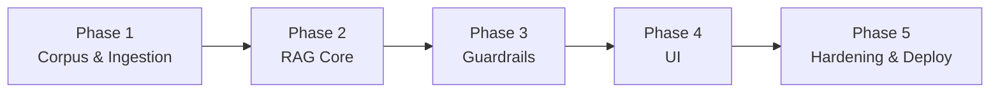
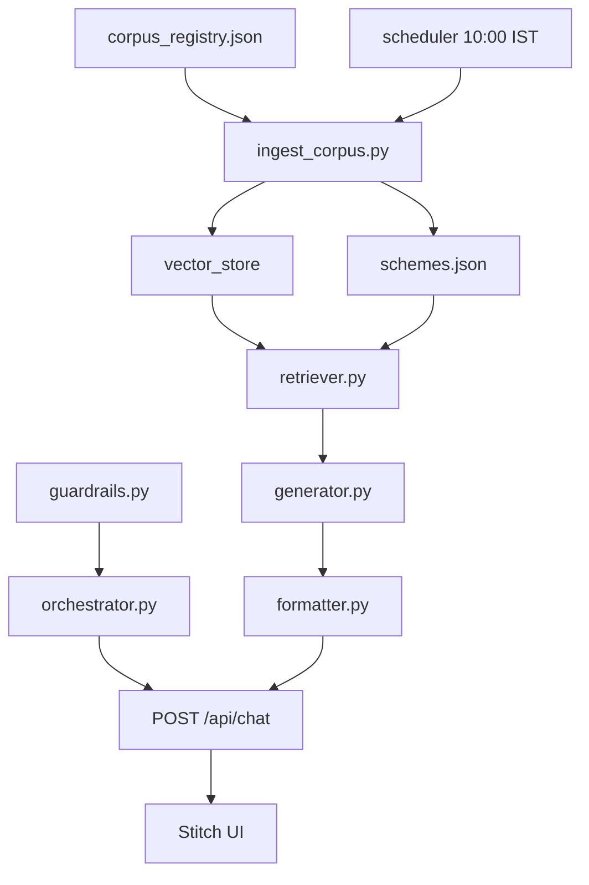

# Phase-Wise Implementation Plan: Mutual Fund FAQ Assistant

This document provides a step-by-step implementation guide for building the facts-only Mutual Fund FAQ Assistant. It is derived from [ProblemStatement.md](./ProblemStatement.md) and [architecture.md](./architecture.md).

---

## Overview

| Item | Detail |
|------|--------|
| **Product** | Facts-only RAG FAQ assistant for Tata Mutual Fund schemes |
| **Corpus** | 15 Groww scheme pages |
| **AMC** | Tata Mutual Fund |
| **Ingestion schedule** | Daily at **10:00 IST** (`Asia/Kolkata`) |
| **Phases** | 5 sequential phases |
| **LLM** | [Groq](https://groq.com/) API |
| **Embeddings** | BGE-large + BGE-small (local, free via `sentence-transformers`) |
| **UI** | [Stitch](https://stitch.withgoogle.com/) |



### Phase Summary

| Phase | Focus | Primary Outcome |
|-------|--------|-----------------|
| **1** | Corpus, ingestion, scheduler | Indexed vector store from 15 schemes |
| **2** | RAG pipeline, chat API | Working `/api/chat` with source-backed answers |
| **3** | Compliance guardrails | Advisory refusals, PII blocking, output validation |
| **4** | Stitch web UI | Chat interface with disclaimer and examples |
| **5** | Testing, docs, deployment | Production-ready, monitored system |

---

## Prerequisites

Before Phase 1, set up the development environment:

- [ ] Python 3.10+
- [ ] Git repository initialized
- [ ] **Groq API key** (`GROQ_API_KEY`) — used for all LLM generation calls
- [ ] **BGE embedding models** — `BAAI/bge-large-en-v1.5` and `BAAI/bge-small-en-v1.5` via `sentence-transformers` (free, run locally; no paid embedding API)
- [ ] **Stitch** — for building the web UI
- [ ] Project folder structure per [architecture.md §12](./architecture.md#12-suggested-project-structure)

**Selected stack:**

| Layer | Technology |
|-------|------------|
| API | FastAPI |
| Vector store | **ChromaDB** (persistent, local) |
| Embeddings (ingestion) | `BAAI/bge-large-en-v1.5` — higher-quality corpus indexing |
| Embeddings (query) | `BAAI/bge-small-en-v1.5` — faster, free runtime query embedding |
| LLM | Groq API (e.g. `llama-3.1-8b-instant` or `llama-3.3-70b-versatile`; low temperature) |
| UI | Stitch |
| Scheduler | cron / APScheduler / Kubernetes CronJob |

**Environment variables (`.env.example`):**

```env
GROQ_API_KEY=your_groq_api_key
GROQ_MODEL=llama-3.1-8b-instant
EMBEDDING_MODEL_LARGE=BAAI/bge-large-en-v1.5
EMBEDDING_MODEL_SMALL=BAAI/bge-small-en-v1.5
```

---

## Phase 1 — Corpus & Ingestion

**Goal:** Build the data foundation — corpus registry, ingestion pipeline, vector index, and daily scheduler at 10:00 IST.

**Duration estimate:** 3–5 days

**Status:** Complete (corpus indexed — 181 chunks, 15 schemes, ChromaDB at `data/index/`)

### 1.1 Tasks

#### 1.1.1 Project scaffolding

- [x] Create repository structure (`app/`, `data/`, `config/`, `scheduler/`, `scripts/`, `tests/`)
- [x] Add `requirements.txt` or `pyproject.toml` with core dependencies
- [x] Add `config/settings.py` for environment variables (`GROQ_API_KEY`, `GROQ_MODEL`, embedding model names, paths, timezone)
- [x] Add `.env.example` with `GROQ_API_KEY` and BGE model config (no secrets committed)
- [x] Add `sentence-transformers`, `chromadb`, and `groq` to `requirements.txt`

#### 1.1.2 Corpus registry

- [x] Create `data/corpus_registry.json` with all 15 schemes:

| scheme_id | scheme_name |
|-----------|-------------|
| `tata-small-cap-fund-direct-growth` | Tata Small Cap Fund Direct Growth |
| `tata-digital-india-fund-direct-growth` | Tata Digital India Fund Direct Growth |
| `tata-silver-etf-fof-direct-growth` | Tata Silver ETF FoF Direct Growth |
| `tata-ethical-fund-direct-growth` | Tata Ethical Fund Direct Growth |
| `tata-arbitrage-fund-direct-growth` | Tata Arbitrage Fund Direct Growth |
| `tata-nifty-capital-markets-index-fund-direct-growth` | Tata Nifty Capital Markets Index Fund Direct Growth |
| `tata-resources-energy-fund-direct-growth` | Tata Resources & Energy Fund Direct Growth |
| `tata-elss-fund-direct-growth` | Tata ELSS Fund Direct Growth |
| `tata-multicap-fund-direct-growth` | Tata Multicap Fund Direct Growth |
| `tata-ultra-short-term-fund-direct-growth` | Tata Ultra Short Term Fund Direct Growth |
| `tata-mid-cap-direct-plan-growth` | Tata Mid Cap Direct Plan Growth |
| `tata-flexi-cap-fund-direct-growth` | Tata Flexi Cap Fund Direct Growth |
| `tata-large-cap-fund-direct-growth` | Tata Large Cap Fund Direct Growth |
| `tata-floater-fund-direct-growth` | Tata Floater Fund Direct Growth |
| `tata-bse-sensex-index-direct` | Tata BSE Sensex Index Direct |

- [x] Each entry includes: `amc`, `scheme_id`, `scheme_name`, `source_url`, `category`, `last_ingested_at`

#### 1.1.3 Ingestion modules (`app/ingestion/`)

- [x] **`fetcher.py`** — Fetch live Groww pages or load pre-saved HTML snapshots from `data/raw/`; respect rate limits
- [x] **`parser.py`** — Extract FAQ-relevant sections: expense ratio, exit load, min SIP, riskometer, benchmark, fund managers, tax, ELSS lock-in
- [x] **`chunker.py`** — Semantic-first chunking (see [§1.1.3a Chunking strategy](#113a-chunking-strategy)); writes `data/processed/<scheme_id>_chunks.json`
- [x] **`embed_index.py`** — Batch embed chunks with **BGE-large** (`BAAI/bge-large-en-v1.5`) and upsert into **ChromaDB** at `data/index/` (local inference, no API cost)

#### 1.1.3a Chunking strategy

Chunking is **semantic-first** for BGE-large retrieval: one topic-pure chunk per FAQ section, not fixed windows over the full cleaned page.

**Inputs**

| Priority | Source | Role |
|----------|--------|------|
| Primary | `data/processed/<scheme_id>.json` → `sections` | One chunk per parsed section (~5–15 tokens each) |
| Fallback | `data/raw/<scheme_id>.cleaned.txt` | Anchor extraction only when a section is missing after live HTML parse |

**Section coverage** (aligned with `parser.SECTION_IDS`): `expense_ratio`, `exit_load`, `min_sip`, `min_lumpsum`, `riskometer`, `benchmark`, `fund_managers`, `tax`, `stamp_duty`, `elss_lock_in`, `investment_objective`, `nav`, `aum`.

**Fallback anchors** (cleaned Groww plain text) — used only for gaps, typically `exit_load`, `tax`, `fund_managers`, `investment_objective`:

| Anchor start | Stop before | `section` id |
|--------------|-------------|--------------|
| `Exit load, stamp duty and tax` | `Compare similar funds` | `exit_load`, `stamp_duty`, `tax` |
| `Fund management` | `Also manages these schemes` / `Investment Objective` | `fund_managers` |
| `Investment Objective` | `Fund benchmark` | `investment_objective` |

**Rules**

| Rule | Detail |
|------|--------|
| **Do not** window-chunk full `.cleaned.txt` | Nav, holdings, return calculators, and compare-funds blocks are excluded |
| **Dedup** | Processed `sections` always win; fallback never overwrites parser output |
| **Default chunk size** | One section = one chunk (most chunks are &lt;50 tokens — ideal for narrow FAQ queries) |
| **Long-section split** | Only when a single section exceeds **450 tokens** (~BGE-large safe limit under 512): sentence-aware split with **60-token overlap** |
| **Fund manager trim** | Drop bios and “Also manages these schemes” cross-links; keep name + tenure only |
| **Scheme filter** | Every chunk carries `scheme_id` for retrieval filtering |

**Chunk metadata** (stored in `*_chunks.json`, passed through to the vector index):

| Field | Example |
|-------|---------|
| `chunk_id` | `tata-elss-fund-direct-growth__expense_ratio__0` |
| `scheme_id` | `tata-elss-fund-direct-growth` |
| `scheme_name` | `Tata ELSS Fund Direct Growth` |
| `source_url` | Groww scheme URL |
| `section` / `section_label` | `expense_ratio` / `Expense ratio` |
| `content` | `Expense ratio: 1.17%` |
| `extracted_at` | ISO timestamp from processed JSON `parsed_at` |
| `chunk_index` | `0` (increments when a section is split) |
| `chunk_source` | `processed` or `cleaned_fallback` |

**BGE-large embed prep** (`build_embed_text()` in `chunker.py` — called from `embed_index.py`):

- Passages are embedded **without** an instruction prefix.
- For short chunks (&lt;50 tokens), prepend `{scheme_name} | {section_label} | {content}` at embed time only; stored `content` stays minimal.
- Queries use the BGE retrieval instruction prefix at runtime (see Phase 2 retriever).

**Expected corpus size:** ~12–13 chunks per scheme, **~180 chunks total** across 15 schemes.

**Review command:**

```bash
python scripts/preview_chunks.py --all
python scripts/preview_chunks.py tata-elss-fund-direct-growth
```

#### 1.1.3b ChromaDB vector index

**Why ChromaDB** (not FAISS) for this corpus: native metadata filtering (`scheme_id`), document + vector storage in one place, simple upsert/delete for daily re-indexing. FAISS adds complexity without benefit at ~180 vectors.

**On-disk layout** (`data/index/`):

| File / folder | Purpose |
|---------------|---------|
| `chroma.sqlite3` | Chroma metadata DB (chunk IDs, text, metadata) |
| `<uuid>/data_level0.bin` | HNSW vector segment (1024-d BGE-large embeddings) |
| `chromadb/manifest.json` | Human-readable export (see below) |
| `chromadb/by_scheme/*.json` | Per-scheme chunk + embedding preview |

**Collection:** `tata_mf_faq_chunks` — cosine space, normalized BGE-large vectors.

**Indexing functions** (`embed_index.py`):

| Function | Purpose |
|----------|---------|
| `rebuild_index()` | Full re-index from all `*_chunks.json` |
| `index_scheme(scheme_id)` | Per-scheme upsert |
| `embed_passages()` / `embed_query()` | BGE-large encode (query uses retrieval instruction prefix) |
| `search()` | Similarity search with optional `scheme_id` filter |
| `stats()` | Index health check |
| `export_index_manifest()` | Write readable JSON to `data/index/chromadb/` |

**Inspect embeddings** (binary vectors are not IDE-friendly; use the manifest export):

```bash
python scripts/export_index_manifest.py
# Opens: data/index/chromadb/manifest.json
#        data/index/chromadb/by_scheme/tata-elss-fund-direct-growth.json
```

Each exported chunk includes `embedding_dim` (1024), `embedding_preview` (first 8 dims), `content`, and citation metadata. Full vectors remain in `chroma.sqlite3`.

#### 1.1.4 Structured metadata (optional but recommended)

- [x] Extract key-value fields per scheme into `data/processed/schemes.json` (e.g. `expense_ratio`, `min_sip`, `exit_load`, `benchmark`)
- [x] Update `last_ingested_at` per scheme after each run

#### 1.1.5 Ingestion entrypoint

- [x] **`scripts/ingest_corpus.py`** — Orchestrates full pipeline for all 15 URLs (fetch → parse → chunk → embed → manifest export)
- [x] Log per-scheme success/failure, total duration, and new `last_ingested_at`
- [x] On partial failure: retry failed URLs once

#### 1.1.6 Daily scheduler (10:00 IST)

- [x] **`scheduler/daily_ingest_job.py`** — Thin wrapper that invokes `ingest_corpus.py`
- [x] **`scheduler/cron.yaml`** — Cron definition: `0 10 * * *` with `TZ=Asia/Kolkata`
- [ ] Configure local dev scheduler (cron, Windows Task Scheduler, or APScheduler) — host-specific
- [x] Document equivalent UTC expression (`30 4 * * *`) for UTC-only hosts

### 1.2 Deliverables

| Deliverable | Location |
|-------------|----------|
| Corpus registry | `data/corpus_registry.json` |
| Raw snapshots | `data/raw/<scheme_id>.{html,json,cleaned.txt}` |
| Processed sections | `data/processed/<scheme_id>.json` |
| Review chunks | `data/processed/<scheme_id>_chunks.json` |
| Vector index | `data/index/` (ChromaDB — `chroma.sqlite3` + HNSW segment) |
| Readable index export | `data/index/chromadb/manifest.json`, `by_scheme/*.json` |
| Scheme metadata | `data/processed/schemes.json` |
| Ingestion script | `scripts/ingest_corpus.py` |
| Chunk review script | `scripts/preview_chunks.py` |
| Embed / search script | `scripts/preview_embed.py` |
| Index manifest export | `scripts/export_index_manifest.py` |
| Index docs | `data/index/README.md` |
| Scheduler config | `scheduler/cron.yaml`, `scheduler/daily_ingest_job.py` |

### 1.3 Acceptance Criteria

- [x] All 15 URLs ingest without error (live fetch or snapshot)
- [x] All 15 schemes produce review chunks (`*_chunks.json`) with correct `scheme_id`, `source_url`, and `section` metadata
- [x] Vector store contains **181** embedded chunks with correct metadata (ChromaDB, BGE-large)
- [x] Manual run of `ingest_corpus.py` completes in under 10 minutes (snapshot mode)
- [x] `last_ingested_at` updates in registry and metadata after a successful run
- [ ] Scheduler fires at 10:00 IST (verified in dev via manual trigger + cron dry-run) — run `python scheduler/daily_ingest_job.py` manually; host cron is optional
- [x] Sample retrieval query returns relevant chunk for "expense ratio Tata ELSS" (BGE-large index + query)

### 1.4 Phase 1 Verification Commands

```bash
# Run full ingestion manually
python scripts/ingest_corpus.py

# Build / refresh review chunks (Phase 1.1.3)
python scripts/preview_chunks.py --all

# Verify total chunk count (~180 across 15 schemes)
python -c "from pathlib import Path; import json; print(sum(json.loads(f.read_text())['chunk_count'] for f in Path('data/processed').glob('*_chunks.json')))"

# Build / verify vector index (ChromaDB)
python scripts/preview_embed.py --all
python -c "from app.ingestion.embed_index import stats; print(stats())"

# Export human-readable embeddings manifest
python scripts/export_index_manifest.py

# Test retrieval
python scripts/preview_embed.py --query "expense ratio" --scheme tata-elss-fund-direct-growth

# Test scheduler entrypoint
python scheduler/daily_ingest_job.py
```

---

## Phase 2 — RAG Core & Chat API

**Goal:** Implement retrieval, generation, response formatting, and the `/api/chat` endpoint.

**Duration estimate:** 4–6 days

**Depends on:** Phase 1 (populated vector store)

### 2.1 Tasks

#### 2.1.1 Core modules (`app/core/`)

- [ ] **`retriever.py`**
  - Embed user query with **BGE-small** (`BAAI/bge-small-en-v1.5`) for fast, free local inference
  - Similarity search against BGE-large-indexed corpus with `k=3–5`
  - Optional `scheme_id` metadata filter when scheme is detected
  - Merge top chunks into context (max ~1500 tokens)

- [ ] **`generator.py`**
  - Call **Groq API** via `GROQ_API_KEY` for text generation
  - Constrained system prompt (facts-only, context-only, no advice)
  - Low temperature (0–0.2)
  - Pass `extracted_at` for footer date

- [ ] **`formatter.py`**
  - Enforce response structure:
    ```text
    <Answer — max 3 sentences>

    Source: <corpus URL>

    Last updated from sources: <date>
    ```
  - URL allowlist against corpus registry

#### 2.1.2 Query orchestrator

- [ ] **`app/core/orchestrator.py`**
  1. Normalize input
  2. Detect scheme from name/alias map
  3. Classify intent (basic keyword rules in this phase; expanded in Phase 3)
  4. Retrieve → generate → format
  5. Return structured JSON response

#### 2.1.3 Scheme detection & aliases

- [ ] Build alias map: `"ELSS"` → `tata-elss-fund-direct-growth`, `"Silver"` → `tata-silver-etf-fof-direct-growth`, etc.
- [ ] If scheme-specific question without resolved scheme → return clarifying message

#### 2.1.4 API layer (`app/api/`)

- [ ] **`chat.py`** — `POST /api/chat`
  ```json
  { "message": "What is the minimum SIP for Tata ELSS?" }
  ```
- [ ] **`health.py`** — `GET /api/health`
- [ ] **`schemes.py`** — `GET /api/schemes` (list 15 schemes for UI)
- [ ] Wire FastAPI app in `app/main.py`

#### 2.1.5 Structured metadata short-circuit (optional)

- [ ] For high-confidence intents (`expense_ratio`, `min_sip`, `exit_load`), answer from `schemes.json` when available; fall back to RAG

### 2.2 Deliverables

| Deliverable | Location |
|-------------|----------|
| Retriever | `app/core/retriever.py` |
| Generator | `app/core/generator.py` |
| Formatter | `app/core/formatter.py` |
| Orchestrator | `app/core/orchestrator.py` |
| Chat API | `app/api/chat.py` |
| API entrypoint | `app/main.py` |

### 2.3 Acceptance Criteria

- [ ] `POST /api/chat` returns factual answer for: expense ratio, min SIP, exit load, benchmark, fund manager
- [ ] Every factual response has exactly one corpus URL citation
- [ ] Every factual response includes `Last updated from sources: <date>` footer
- [ ] Answers are ≤3 sentences
- [ ] `GET /api/schemes` returns all 15 schemes
- [ ] `GET /api/health` returns 200
- [ ] Unresolved scheme name triggers clarification, not hallucination
- [ ] LLM responses are generated via **Groq API** (not OpenAI/Anthropic)
- [ ] Query embeddings use **BGE-small**; corpus indexed with **BGE-large**

### 2.4 Sample Test Queries

| Query | Expected behavior |
|-------|-------------------|
| What is the expense ratio of Tata Large Cap Fund Direct Growth? | Factual answer + Groww URL |
| What is the minimum SIP for Tata ELSS? | Factual answer with ₹ amount |
| Who manages Tata Flexi Cap Fund? | Fund manager name(s) |
| What is the benchmark for Tata BSE Sensex Index Direct? | Benchmark index name |

---

## Phase 3 — Guardrails & Compliance

**Goal:** Enforce facts-only policy — block advisory queries, PII, and invalid outputs.

**Duration estimate:** 3–4 days

**Depends on:** Phase 2 (working chat pipeline)

### 3.1 Tasks

#### 3.1.1 Input guardrails (`app/core/guardrails.py`)

- [ ] **PII scanner** — Regex for PAN, Aadhaar, account numbers, OTP patterns, email, phone
  - Action: refuse immediately; do not log raw payload

- [ ] **Advisory detector** — Patterns: `should I`, `recommend`, `better`, `buy or sell`, `which fund`, `worth investing`
  - Action: refusal template

- [ ] **Comparative detector** — `better than`, `compare`, `vs`, `which is best`
  - Action: refusal template

- [ ] **Performance handler** — Detect return/performance questions
  - Action: no calculation; return scheme page link only

- [ ] **Out-of-corpus handler** — Scheme not in registry
  - Action: clarify scope (15 Tata schemes only)

#### 3.1.2 Output validation

- [ ] Sentence count ≤ 3
- [ ] Exactly one URL from allowlist (corpus or AMFI/SEBI for refusals)
- [ ] No advice/recommendation language in output
- [ ] No return calculations or fund comparisons
- [ ] Footer present with valid date
- [ ] On failure: regenerate once with stricter prompt, then safe fallback template

#### 3.1.3 Refusal templates

- [ ] Polite advisory refusal + [AMFI Investor Corner](https://www.amfiindia.com/investor-corner) or [SEBI Investor Education](https://investor.sebi.gov.in/)
- [ ] PII refusal (no storage, no forwarding to LLM)
- [ ] Performance refusal (link to scheme page only)

#### 3.1.4 Integrate guardrails into orchestrator

- [ ] Pre-retrieval: input classification + PII scan
- [ ] Post-generation: output validation loop
- [ ] Return `type: "refusal"` with `reason` field in API response

#### 3.1.5 Admin ingest endpoint (optional)

- [ ] `POST /api/ingest` — Protected by API key; manual re-index outside 10:00 IST window

### 3.2 Deliverables

| Deliverable | Location |
|-------------|----------|
| Guardrail engine | `app/core/guardrails.py` |
| Refusal templates | `app/core/templates.py` |
| Unit tests | `tests/test_guardrails.py` |

### 3.3 Acceptance Criteria

- [ ] "Should I invest in Tata Small Cap?" → polite refusal + educational link
- [ ] "Which fund is better?" → refusal
- [ ] Query containing mock PAN pattern → refused; not stored in logs
- [ ] "What returns did Tata ELSS give last year?" → scheme page link only, no calculated return
- [ ] Generated answer with 4 sentences → blocked or truncated by validator
- [ ] Generated answer with non-corpus URL → blocked or corrected
- [ ] All refusals include exactly one educational or scheme citation

### 3.4 Refusal Test Suite

| Input | Expected `reason` |
|-------|-------------------|
| Should I invest in this fund? | `advisory` |
| Which fund is better, ELSS or Large Cap? | `comparative` |
| My PAN is ABCDE1234F, check my fund | `pii` |
| What was the 1-year return? | `performance` |

---

## Phase 4 — User Interface (Stitch)

**Goal:** Deliver a minimal, compliant chat UI per problem statement, built with **Stitch**.

**Duration estimate:** 2–4 days

**Depends on:** Phase 2 (API) and Phase 3 (guardrails)

### 4.1 Tasks

#### 4.1.1 Stitch UI design & build

- [ ] Create the chat layout in **Stitch** (welcome screen, disclaimer, example chips, message thread, input bar)
- [ ] Export / implement Stitch design as the frontend in `app/ui/`
- [ ] Header: **Mutual Fund FAQ Assistant**
- [ ] Persistent disclaimer banner:
  > Facts-only. No investment advice.
- [ ] Welcome message explaining scope (15 Tata schemes on Groww)
- [ ] Three clickable example questions:
  1. What is the minimum SIP for Tata ELSS?
  2. What is the exit load on Tata Silver ETF FoF?
  3. Who manages the Tata Flexi Cap Fund?
- [ ] Chat message area (user + assistant bubbles)
- [ ] Input field + send button
- [ ] Render source links and footer from API response

#### 4.1.2 API integration

- [ ] `POST /api/chat` on submit
- [ ] Loading state while waiting
- [ ] Error handling for network/API failures
- [ ] Optional: `GET /api/schemes` for scheme name hints

#### 4.1.3 UX & compliance

- [ ] No login, no PII form fields
- [ ] Sanitize rendered HTML / use safe markdown renderer in Stitch-built UI
- [ ] Mobile-friendly minimal layout
- [ ] Example chips populate input on click

#### 4.1.4 Stitch implementation notes

| Item | Detail |
|------|--------|
| **Tool** | [Stitch](https://stitch.withgoogle.com/) — UI design and frontend build |
| **Location** | `app/ui/` — exported Stitch components/pages |
| **API base URL** | Configure FastAPI backend URL for `POST /api/chat` |
| **CORS** | Backend must allow Stitch UI origin |

### 4.2 Deliverables

| Deliverable | Location |
|-------------|----------|
| Stitch chat UI | `app/ui/` |
| Disclaimer component | Stitch UI — persistent banner |
| Example question chips | Stitch UI — clickable chips |

### 4.3 Acceptance Criteria

- [ ] Disclaimer visible on every screen without scrolling (banner or subtitle)
- [ ] Welcome message shown on first load
- [ ] All three example questions are clickable and send queries
- [ ] Factual answers display citation link and footer date
- [ ] Refusal messages display educational link
- [ ] No user data persisted in browser beyond session chat (optional: no persistence at all)
- [ ] UI works against local API on `localhost`

---

## Phase 5 — Hardening, Testing & Deployment

**Goal:** Production readiness — tests, monitoring, README, deployment, scheduler ops.

**Duration estimate:** 4–5 days

**Depends on:** Phases 1–4 complete

### 5.1 Tasks

#### 5.1.1 Test suite

- [ ] **Unit tests** — PII regex, advisory keywords, sentence/link counting (`tests/test_guardrails.py`)
- [ ] **Integration tests** — Retrieval accuracy per scheme (`tests/test_retrieval.py`)
- [ ] **Format tests** — Footer and citation structure (`tests/test_response_format.py`)
- [ ] **Golden-set QA** — 30–50 factual Q&A pairs with expected fields and URLs
- [ ] **Refusal suite** — All advisory/comparison/PII cases
- [ ] **Scheduler test** — Daily job completes for 15 URLs; `last_ingested_at` updates

#### 5.1.2 Golden-set examples (minimum 20)

| # | Question | Validate |
|---|----------|----------|
| 1 | Min SIP for Tata ELSS | Amount + URL |
| 2 | Exit load on Tata Arbitrage | Load text + URL |
| 3 | Benchmark for Tata BSE Sensex Index | Index name + URL |
| 4 | Expense ratio of Tata Silver ETF FoF | Percentage + URL |
| 5 | Risk level of Tata Small Cap | Riskometer + URL |
| 6 | Fund manager of Tata Multicap | Name(s) + URL |
| 7 | Min lumpsum for Tata Large Cap | Amount + URL |
| 8 | ELSS lock-in for Tata ELSS | Lock-in period + URL |
| 9–20 | Rotate across remaining schemes | Field + URL |
| 21+ | Advisory/refusal cases | Refusal + AMFI/SEBI link |

#### 5.1.3 Security & reliability

- [ ] Rate limiting on `/api/chat` (e.g. 30 req/min per IP)
- [ ] Environment variables for all secrets (`GROQ_API_KEY`, etc.)
- [ ] Minimal logging (intent class, `scheme_id`; no raw PII)
- [ ] CORS configured for Stitch UI origin
- [ ] Health check endpoint monitored

#### 5.1.4 Scheduler operations

- [ ] Production cron / CronJob at **10:00 IST**
- [ ] Runbook: what to do on ingestion failure
- [ ] Alerting on stale `last_ingested_at` (> 26 hours)
- [ ] Log retention for ingestion runs (start, end, success/fail counts)

#### 5.1.5 Documentation

- [ ] **`README.md`** with:
  - Setup instructions (Groq API key, BGE model download, Stitch UI)
  - Selected AMC and 15 schemes
  - Architecture overview (RAG + daily 10:00 IST ingestion)
  - Known limitations
  - How to run ingestion manually
  - How to run tests

- [ ] **Disclaimer snippet** in README and UI:
  > Facts-only. No investment advice.

#### 5.1.6 Deployment

- [ ] Containerize API (Dockerfile)
- [ ] Mount or bake vector store volume
- [ ] Separate scheduler container or platform CronJob
- [ ] Deploy Stitch-built UI (static hosting or alongside API)
- [ ] Smoke test in staging: chat + scheduled ingestion

### 5.2 Deliverables

| Deliverable | Location |
|-------------|----------|
| Full test suite | `tests/` |
| README | `README.md` |
| Dockerfile | `Dockerfile` |
| Scheduler runbook | `Docs folder/scheduler-runbook.md` (optional) |
| Deployed staging environment | — |

### 5.3 Acceptance Criteria (Success Criteria Traceability)

| Success Criterion | Verification |
|-------------------|--------------|
| Accurate factual retrieval | Golden-set pass rate ≥ 90% |
| Facts-only responses | Refusal suite 100% pass |
| Valid source citations | Every answer URL ∈ corpus registry |
| Proper advisory refusal | Advisory suite 100% pass |
| Clean minimal UI | Stitch UI manual UX review checklist |
| Daily data freshness | Scheduler runs at 10:00 IST; `last_ingested_at` current |

---

## Cross-Phase Dependency Map



---

## Implementation Timeline (Suggested)

| Week | Phase | Milestone |
|------|-------|-----------|
| 1 | Phase 1 | Corpus indexed; scheduler configured |
| 2 | Phase 2 | `/api/chat` returns source-backed answers |
| 2–3 | Phase 3 | Guardrails block advisory/PII; output validated |
| 3 | Phase 4 | Stitch UI live with disclaimer and examples |
| 4 | Phase 5 | Tests green; README; staging deployed |

**Total estimate:** 3–4 weeks for a single developer

---

## Risk Register

| Risk | Phase | Mitigation |
|------|-------|------------|
| Groww page structure changes | 1, 5 | Version raw snapshots; parser unit tests |
| LLM hallucination | 2, 3 | Retrieval-first; Groq low temperature; structured metadata; output validation |
| Scheduler misses run | 1, 5 | Staleness alert; serve last good index |
| BGE model download on first run | 1, 2 | Cache models locally; document `sentence-transformers` setup |
| Rate limiting from Groww | 1 | Throttle fetches; use snapshots as fallback |
| Groq API rate limits | 2, 5 | Retry with backoff; choose appropriate Groq model tier |
| Scheme name ambiguity | 2, 4 | Alias map; ask clarifying question in Stitch UI |

---

## Definition of Done (Project Complete)

The project is complete when all of the following are true:

- [ ] All 5 phases meet their acceptance criteria
- [ ] 15-scheme corpus ingests successfully on manual and scheduled runs
- [ ] Daily scheduler runs at **10:00 IST** in the target environment
- [ ] Chat API answers factual queries with ≤3 sentences, one citation, and footer date
- [ ] Advisory, comparative, PII, and performance queries are handled per spec
- [ ] Stitch UI shows welcome message, three examples, and persistent disclaimer
- [ ] README documents setup, architecture, schemes, and limitations
- [ ] Golden-set and refusal test suites pass in CI

---

## References

- [ProblemStatement.md](./ProblemStatement.md) — requirements, corpus URLs, constraints, 10:00 IST schedule
- [architecture.md](./architecture.md) — system design, components, API contracts, data models
- [AMFI Investor Corner](https://www.amfiindia.com/investor-corner)
- [SEBI Investor Education](https://investor.sebi.gov.in/)
