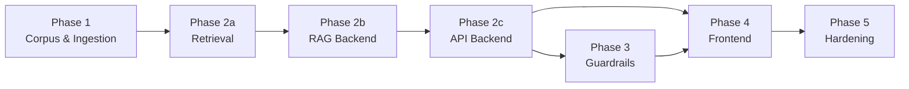
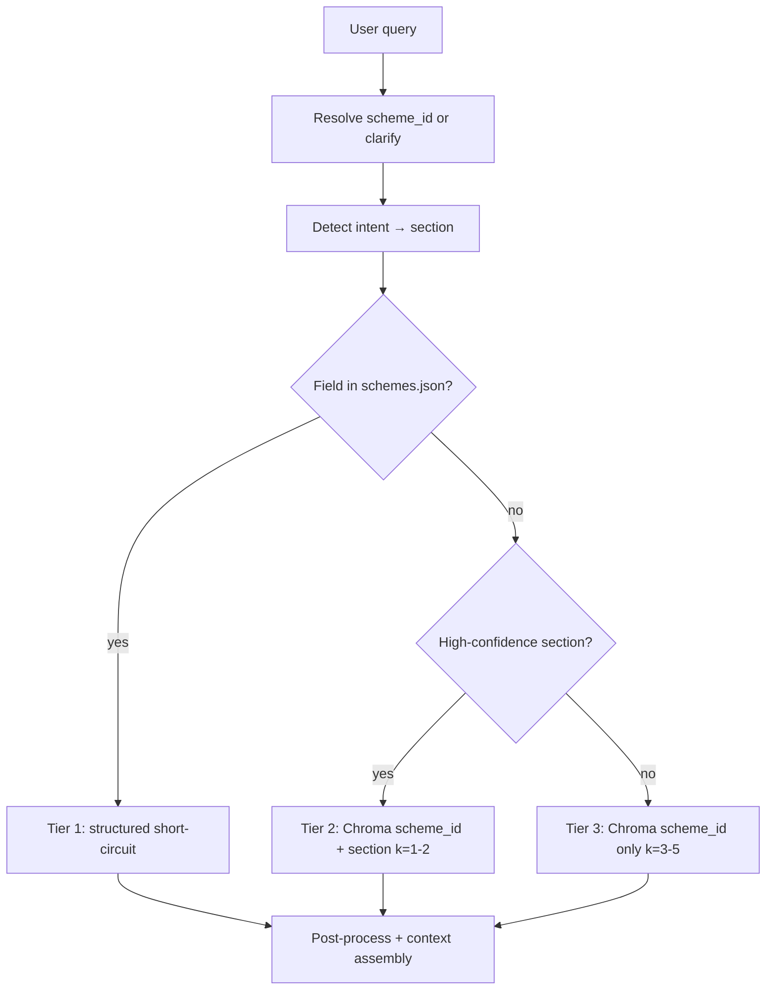
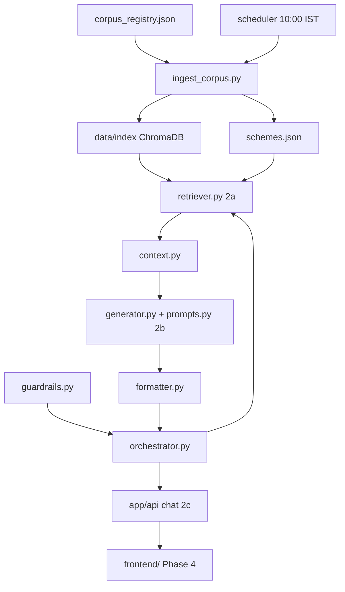

# Phase-Wise Implementation Plan: Mutual Fund FAQ Assistant

This document provides a step-by-step implementation guide for building the facts-only Mutual Fund FAQ Assistant. It is derived from [ProblemStatement.md](./ProblemStatement.md) and [architecture.md](./architecture.md).

---

## Overview

| Item | Detail |
|------|--------|
| **Product** | Facts-only RAG FAQ assistant for Tata Mutual Fund schemes |
| **Corpus** | 15 Groww scheme pages |
| **AMC** | Tata Mutual Fund |
| **Ingestion schedule** | Daily at **10:00 IST** (`Asia/Kolkata`) |
| **Phases** | 5 sequential phases |
| **LLM** | [Groq](https://groq.com/) API |
| **Embeddings** | BGE-large (index + query); ChromaDB |
| **UI** | [Stitch](https://stitch.withgoogle.com/) |



### Phase Summary

| Phase | Focus | Primary Outcome |
|-------|--------|-----------------|
| **1** | Corpus, ingestion, scheduler | ChromaDB index — 181 chunks, 15 schemes |
| **2a** | Retrieval layer | 3-tier hybrid retriever (`scheme_id` + section filters) |
| **2b** | RAG backend | Groq generator + system prompt + context assembly + formatter |
| **2c** | API backend | FastAPI `POST /api/chat`, health, schemes |
| **3** | Compliance guardrails | Advisory refusals, PII blocking, output validation |
| **4** | Frontend (Stitch) | Chat UI in `frontend/` calling the API |
| **5** | Testing, docs, deployment | Production-ready, monitored system |

---

## Prerequisites

Before Phase 1, set up the development environment:

- [ ] Python 3.10+
- [ ] Git repository initialized
- [ ] **Groq API key** (`GROQ_API_KEY`) — used for all LLM generation calls
- [ ] **BGE embedding models** — `BAAI/bge-large-en-v1.5` and `BAAI/bge-small-en-v1.5` via `sentence-transformers` (free, run locally; no paid embedding API)
- [ ] **Stitch** — for building the web UI
- [ ] Project folder structure per [architecture.md §12](./architecture.md#12-suggested-project-structure)

**Selected stack:**

| Layer | Technology |
|-------|------------|
| API | FastAPI |
| Vector store | **ChromaDB** (persistent, local) |
| Embeddings (ingestion + query) | `BAAI/bge-large-en-v1.5` — same model for Chroma index and query (1024-d) |
| Embeddings (optional future) | `BAAI/bge-small-en-v1.5` — only if a separate small-model index is added |
| LLM | Groq API (e.g. `llama-3.1-8b-instant` or `llama-3.3-70b-versatile`; low temperature) |
| UI | Stitch |
| Scheduler | cron / APScheduler / Kubernetes CronJob |

**Environment variables (`.env.example`):**

```env
GROQ_API_KEY=your_groq_api_key
GROQ_MODEL=llama-3.1-8b-instant
EMBEDDING_MODEL_LARGE=BAAI/bge-large-en-v1.5
EMBEDDING_MODEL_SMALL=BAAI/bge-small-en-v1.5
```

---

## Repository layout (Phase 2+)

Split **backend** (Python / FastAPI / RAG) from **frontend** (Stitch UI). Phase 1 ingestion code stays in the backend tree.

```
TATA-mutual-fund-FAQ/
├── backend/                      # BACKEND — Python / FastAPI / RAG
│   ├── README.md
│   ├── .env.example
│   ├── requirements.txt
│   ├── app/
│   │   ├── main.py               # FastAPI entrypoint (uvicorn app.main:app)
│   │   ├── api/                  # REST routes (thin — no business logic)
│   │   │   ├── chat.py           # POST /api/chat
│   │   │   ├── health.py         # GET /api/health
│   │   │   └── schemes.py        # GET /api/schemes
│   │   ├── core/                 # RAG backend
│   │   │   ├── retriever.py      # Phase 2a — hybrid retrieval
│   │   │   ├── context.py
│   │   │   ├── prompts.py
│   │   │   ├── generator.py
│   │   │   ├── formatter.py
│   │   │   ├── orchestrator.py
│   │   │   ├── scheme_aliases.py
│   │   │   └── corpus_registry.py
│   │   └── ingestion/            # Phase 1 pipeline
│   ├── config/
│   │   └── settings.py
│   ├── scripts/
│   ├── scheduler/
│   └── tests/
├── frontend/                     # FRONTEND — Stitch-exported chat UI
│   ├── README.md
│   ├── package.json
│   ├── .env.example              # VITE_API_BASE_URL=http://localhost:8000
│   └── src/                      # Components, pages, API client
├── data/                         # corpus, index, processed (shared)
└── Docs folder/
```

| Run | Command |
|-----|---------|
| Backend API | `cd backend && uvicorn app.main:app --reload --port 8000` |
| Frontend dev | `cd frontend && npm run dev` |
| Full ingest | `cd backend && python scripts/ingest_corpus.py` |

---

## Phase 1 — Corpus & Ingestion

**Goal:** Build the data foundation — corpus registry, ingestion pipeline, vector index, and daily scheduler at 10:00 IST.

**Duration estimate:** 3–5 days

**Status:** Complete (corpus indexed — 181 chunks, 15 schemes, ChromaDB at `data/index/`)

### 1.1 Tasks

#### 1.1.1 Project scaffolding

- [x] Create repository structure (`app/`, `data/`, `config/`, `scheduler/`, `scripts/`, `tests/`)
- [x] Add `requirements.txt` or `pyproject.toml` with core dependencies
- [x] Add `config/settings.py` for environment variables (`GROQ_API_KEY`, `GROQ_MODEL`, embedding model names, paths, timezone)
- [x] Add `.env.example` with `GROQ_API_KEY` and BGE model config (no secrets committed)
- [x] Add `sentence-transformers`, `chromadb`, and `groq` to `requirements.txt`

#### 1.1.2 Corpus registry

- [x] Create `data/corpus_registry.json` with all 15 schemes:

| scheme_id | scheme_name |
|-----------|-------------|
| `tata-small-cap-fund-direct-growth` | Tata Small Cap Fund Direct Growth |
| `tata-digital-india-fund-direct-growth` | Tata Digital India Fund Direct Growth |
| `tata-silver-etf-fof-direct-growth` | Tata Silver ETF FoF Direct Growth |
| `tata-ethical-fund-direct-growth` | Tata Ethical Fund Direct Growth |
| `tata-arbitrage-fund-direct-growth` | Tata Arbitrage Fund Direct Growth |
| `tata-nifty-capital-markets-index-fund-direct-growth` | Tata Nifty Capital Markets Index Fund Direct Growth |
| `tata-resources-energy-fund-direct-growth` | Tata Resources & Energy Fund Direct Growth |
| `tata-elss-fund-direct-growth` | Tata ELSS Fund Direct Growth |
| `tata-multicap-fund-direct-growth` | Tata Multicap Fund Direct Growth |
| `tata-ultra-short-term-fund-direct-growth` | Tata Ultra Short Term Fund Direct Growth |
| `tata-mid-cap-direct-plan-growth` | Tata Mid Cap Direct Plan Growth |
| `tata-flexi-cap-fund-direct-growth` | Tata Flexi Cap Fund Direct Growth |
| `tata-large-cap-fund-direct-growth` | Tata Large Cap Fund Direct Growth |
| `tata-floater-fund-direct-growth` | Tata Floater Fund Direct Growth |
| `tata-bse-sensex-index-direct` | Tata BSE Sensex Index Direct |

- [x] Each entry includes: `amc`, `scheme_id`, `scheme_name`, `source_url`, `category`, `last_ingested_at`

#### 1.1.3 Ingestion modules (`app/ingestion/`)

- [x] **`fetcher.py`** — Fetch live Groww pages or load pre-saved HTML snapshots from `data/raw/`; respect rate limits
- [x] **`parser.py`** — Extract FAQ-relevant sections: expense ratio, exit load, min SIP, riskometer, benchmark, fund managers, tax, ELSS lock-in
- [x] **`chunker.py`** — Semantic-first chunking (see [§1.1.3a Chunking strategy](#113a-chunking-strategy)); writes `data/processed/<scheme_id>_chunks.json`
- [x] **`embed_index.py`** — Batch embed chunks with **BGE-large** (`BAAI/bge-large-en-v1.5`) and upsert into **ChromaDB** at `data/index/` (local inference, no API cost)

#### 1.1.3a Chunking strategy

Chunking is **semantic-first** for BGE-large retrieval: one topic-pure chunk per FAQ section, not fixed windows over the full cleaned page.

**Inputs**

| Priority | Source | Role |
|----------|--------|------|
| Primary | `data/processed/<scheme_id>.json` → `sections` | One chunk per parsed section (~5–15 tokens each) |
| Fallback | `data/raw/<scheme_id>.cleaned.txt` | Anchor extraction only when a section is missing after live HTML parse |

**Section coverage** (aligned with `parser.SECTION_IDS`): `expense_ratio`, `exit_load`, `min_sip`, `min_lumpsum`, `riskometer`, `benchmark`, `fund_managers`, `tax`, `stamp_duty`, `elss_lock_in`, `investment_objective`, `nav`, `aum`.

**Fallback anchors** (cleaned Groww plain text) — used only for gaps, typically `exit_load`, `tax`, `fund_managers`, `investment_objective`:

| Anchor start | Stop before | `section` id |
|--------------|-------------|--------------|
| `Exit load, stamp duty and tax` | `Compare similar funds` | `exit_load`, `stamp_duty`, `tax` |
| `Fund management` | `Also manages these schemes` / `Investment Objective` | `fund_managers` |
| `Investment Objective` | `Fund benchmark` | `investment_objective` |

**Rules**

| Rule | Detail |
|------|--------|
| **Do not** window-chunk full `.cleaned.txt` | Nav, holdings, return calculators, and compare-funds blocks are excluded |
| **Dedup** | Processed `sections` always win; fallback never overwrites parser output |
| **Default chunk size** | One section = one chunk (most chunks are &lt;50 tokens — ideal for narrow FAQ queries) |
| **Long-section split** | Only when a single section exceeds **450 tokens** (~BGE-large safe limit under 512): sentence-aware split with **60-token overlap** |
| **Fund manager trim** | Drop bios and “Also manages these schemes” cross-links; keep name + tenure only |
| **Scheme filter** | Every chunk carries `scheme_id` for retrieval filtering |

**Chunk metadata** (stored in `*_chunks.json`, passed through to the vector index):

| Field | Example |
|-------|---------|
| `chunk_id` | `tata-elss-fund-direct-growth__expense_ratio__0` |
| `scheme_id` | `tata-elss-fund-direct-growth` |
| `scheme_name` | `Tata ELSS Fund Direct Growth` |
| `source_url` | Groww scheme URL |
| `section` / `section_label` | `expense_ratio` / `Expense ratio` |
| `content` | `Expense ratio: 1.17%` |
| `extracted_at` | ISO timestamp from processed JSON `parsed_at` |
| `chunk_index` | `0` (increments when a section is split) |
| `chunk_source` | `processed` or `cleaned_fallback` |

**BGE-large embed prep** (`build_embed_text()` in `chunker.py` — called from `embed_index.py`):

- Passages are embedded **without** an instruction prefix.
- For short chunks (&lt;50 tokens), prepend `{scheme_name} | {section_label} | {content}` at embed time only; stored `content` stays minimal.
- Queries use the BGE retrieval instruction prefix at runtime (see Phase 2 retriever).

**Expected corpus size:** ~12–13 chunks per scheme, **~180 chunks total** across 15 schemes.

**Review command:**

```bash
python scripts/preview_chunks.py --all
python scripts/preview_chunks.py tata-elss-fund-direct-growth
```

#### 1.1.3b ChromaDB vector index

**Why ChromaDB** (not FAISS) for this corpus: native metadata filtering (`scheme_id`), document + vector storage in one place, simple upsert/delete for daily re-indexing. FAISS adds complexity without benefit at ~180 vectors.

**On-disk layout** (`data/index/`):

| File / folder | Purpose |
|---------------|---------|
| `chroma.sqlite3` | Chroma metadata DB (chunk IDs, text, metadata) |
| `<uuid>/data_level0.bin` | HNSW vector segment (1024-d BGE-large embeddings) |
| `chromadb/manifest.json` | Human-readable export (see below) |
| `chromadb/by_scheme/*.json` | Per-scheme chunk + embedding preview |

**Collection:** `tata_mf_faq_chunks` — cosine space, normalized BGE-large vectors.

**Indexing functions** (`embed_index.py`):

| Function | Purpose |
|----------|---------|
| `rebuild_index()` | Full re-index from all `*_chunks.json` |
| `index_scheme(scheme_id)` | Per-scheme upsert |
| `embed_passages()` / `embed_query()` | BGE-large encode (query uses retrieval instruction prefix) |
| `search()` | Similarity search with optional `scheme_id` filter |
| `stats()` | Index health check |
| `export_index_manifest()` | Write readable JSON to `data/index/chromadb/` |

**Inspect embeddings** (binary vectors are not IDE-friendly; use the manifest export):

```bash
python scripts/export_index_manifest.py
# Opens: data/index/chromadb/manifest.json
#        data/index/chromadb/by_scheme/tata-elss-fund-direct-growth.json
```

Each exported chunk includes `embedding_dim` (1024), `embedding_preview` (first 8 dims), `content`, and citation metadata. Full vectors remain in `chroma.sqlite3`.

#### 1.1.4 Structured metadata (optional but recommended)

- [x] Extract key-value fields per scheme into `data/processed/schemes.json` (e.g. `expense_ratio`, `min_sip`, `exit_load`, `benchmark`)
- [x] Update `last_ingested_at` per scheme after each run

#### 1.1.5 Ingestion entrypoint

- [x] **`scripts/ingest_corpus.py`** — Orchestrates full pipeline for all 15 URLs (fetch → parse → chunk → embed → manifest export)
- [x] Log per-scheme success/failure, total duration, and new `last_ingested_at`
- [x] On partial failure: retry failed URLs once

#### 1.1.6 Daily scheduler (10:00 IST)

- [x] **`scheduler/daily_ingest_job.py`** — Thin wrapper that invokes `ingest_corpus.py`
- [x] **`scheduler/cron.yaml`** — Cron definition: `0 10 * * *` with `TZ=Asia/Kolkata`
- [x] **GitHub Actions** — `.github/workflows/daily-ingest.yml` at `30 4 * * *` UTC (10:00 IST)
- [ ] Configure local dev scheduler (cron, Windows Task Scheduler, or APScheduler) — host-specific
- [x] Document equivalent UTC expression (`30 4 * * *`) for UTC-only hosts

### 1.2 Deliverables

| Deliverable | Location |
|-------------|----------|
| Corpus registry | `data/corpus_registry.json` |
| Raw snapshots | `data/raw/<scheme_id>.{html,json,cleaned.txt}` |
| Processed sections | `data/processed/<scheme_id>.json` |
| Review chunks | `data/processed/<scheme_id>_chunks.json` |
| Vector index | `data/index/` (ChromaDB — `chroma.sqlite3` + HNSW segment) |
| Readable index export | `data/index/chromadb/manifest.json`, `by_scheme/*.json` |
| Scheme metadata | `data/processed/schemes.json` |
| Ingestion script | `scripts/ingest_corpus.py` |
| Chunk review script | `scripts/preview_chunks.py` |
| Embed / search script | `scripts/preview_embed.py` |
| Index manifest export | `scripts/export_index_manifest.py` |
| Index docs | `data/index/README.md` |
| Scheduler config | `scheduler/cron.yaml`, `scheduler/daily_ingest_job.py` |

### 1.3 Acceptance Criteria

- [x] All 15 URLs ingest without error (live fetch or snapshot)
- [x] All 15 schemes produce review chunks (`*_chunks.json`) with correct `scheme_id`, `source_url`, and `section` metadata
- [x] Vector store contains **181** embedded chunks with correct metadata (ChromaDB, BGE-large)
- [x] Manual run of `ingest_corpus.py` completes in under 10 minutes (snapshot mode)
- [x] `last_ingested_at` updates in registry and metadata after a successful run
- [ ] Scheduler fires at 10:00 IST (verified in dev via manual trigger + cron dry-run) — run `python scheduler/daily_ingest_job.py` manually; host cron is optional
- [x] Sample retrieval query returns relevant chunk for "expense ratio Tata ELSS" (BGE-large index + query)

### 1.4 Phase 1 Verification Commands

```bash
# Run full ingestion manually
python scripts/ingest_corpus.py

# Build / refresh review chunks (Phase 1.1.3)
python scripts/preview_chunks.py --all

# Verify total chunk count (~180 across 15 schemes)
python -c "from pathlib import Path; import json; print(sum(json.loads(f.read_text())['chunk_count'] for f in Path('data/processed').glob('*_chunks.json')))"

# Build / verify vector index (ChromaDB)
python scripts/preview_embed.py --all
python -c "from app.ingestion.embed_index import stats; print(stats())"

# Export human-readable embeddings manifest
python scripts/export_index_manifest.py

# Test retrieval
python scripts/preview_embed.py --query "expense ratio" --scheme tata-elss-fund-direct-growth

# Test scheduler entrypoint
python scheduler/daily_ingest_job.py
```

---

## Phase 2 — Retrieval, RAG Backend & API

**Goal:** Build the full question-answering stack: hybrid retrieval → Groq generation with a strict system prompt → formatted API responses.

**Duration estimate:** 4–6 days

**Depends on:** Phase 1 (ChromaDB index at `data/index/`, `schemes.json`)

**Status:** Complete (3-tier retriever, Groq RAG pipeline, FastAPI `/api/chat`, `/api/health`, `/api/schemes`)

Phase 2 is split into three build steps: **2a Retrieval** → **2b RAG backend** → **2c API backend**. Phase 4 adds the **frontend** in `frontend/`.

---

### Phase 2a — Retrieval layer (`app/core/retriever.py`)

**Why hybrid retrieval:** Chunks are **one FAQ section each** (~12–13 per scheme). Pure vector search across 181 chunks without `scheme_id` risks wrong-scheme answers. Structured `schemes.json` already holds many point facts.

#### 2a.1 Three-tier retrieval strategy



| Tier | When | Action |
|------|------|--------|
| **1 — Structured** | `scheme_id` + intent maps to field in `schemes.json` (`expense_ratio`, `min_sip`, `benchmark`, …) | Return fact from metadata; attach `source_url` + `last_ingested_at` |
| **2 — Section vector** | Intent → `section` confident (e.g. “exit load” → `exit_load`) | Chroma `where`: `scheme_id` **and** `section`; `k=1–2` |
| **3 — Broad vector** | Intent unclear or tier 2 empty | Chroma `where`: `scheme_id` only; `k=3` (up to `5` for `tax`, `fund_managers`) |

#### 2a.2 Retriever tasks

- [x] **`retriever.py`** — Implement `retrieve(query, scheme_id?, intent_section?) -> RetrievalResult`
- [x] Embed queries with **BGE-large** (same 1024-d model as index) via `embed_index.embed_query()`
- [x] **Require `scheme_id` filter** when scheme is resolved; if unresolved → orchestrator clarifies (no global search)
- [x] Intent → section keyword map (`annual fee` → `expense_ratio`, `minimum SIP` → `min_sip`, …)
- [x] Post-retrieval: dedupe by `section`; prefer `chunk_source=processed` over `cleaned_fallback`
- [x] Score threshold: weak similarity → safe fallback template (do not hallucinate)
- [x] Exclude `nav` section unless user explicitly asks for NAV
- [x] Merge chunks into context string (max ~1500 tokens; typically 3–5 micro-chunks fit easily)

#### 2a.3 Retriever constants

| Parameter | Value |
|-----------|-------|
| Embedding model | `BAAI/bge-large-en-v1.5` |
| Vector store | ChromaDB `tata_mf_faq_chunks` |
| Query prefix | `Represent this sentence for searching relevant passages: ` |
| `k` (section-known) | `1–2` |
| `k` (broad fallback) | `3–5` |

---

### Phase 2b — RAG backend (Groq + prompts + formatter)

Core generation logic lives in `app/core/` — **not** in API route handlers.

#### 2b.1 Module tasks

- [x] **`context.py`** — Build LLM context block from `RetrievalResult` (chunk `content`, `section`, `scheme_name`, `extracted_at`)
- [x] **`prompts.py`** — Centralize system prompt and user message template (see §2b.2)
- [x] **`generator.py`** — Groq chat completion (`GROQ_API_KEY`, `GROQ_MODEL`, temperature `0–0.2`)
- [x] **`formatter.py`** — Enforce output structure; URL allowlist vs corpus registry
- [x] **`orchestrator.py`** — Pipeline: normalize → scheme detect → intent → retrieve → generate → format → JSON

#### 2b.2 System prompt (store in `app/core/prompts.py`)

Use this as the **system** message for every Groq call. Keep it stable; tune only with golden-set evals.

```text
You are the Mutual Fund FAQ Assistant for Tata Mutual Fund schemes listed on Groww.
You answer facts-only questions using ONLY the retrieved context below.

STRICT RULES:
1. Use only facts present in RETRIEVED CONTEXT. If the answer is not in context, say you cannot find that information in the official scheme sources and point the user to the scheme page URL provided in context.
2. Do NOT give investment advice, recommendations, opinions, or predictions.
3. Do NOT compare funds, rank funds, or say one fund is better than another.
4. Do NOT calculate, estimate, or infer returns, performance, or future outcomes.
5. Do NOT invent numbers, fund names, URLs, fund managers, or dates not in context.
6. Keep the answer body to a maximum of 3 short sentences.
7. Use the exact currency symbols and percentages from context (e.g. ₹, %).
8. If context conflicts, prefer the most specific section chunk over general text.

OUTPUT FORMAT (plain text only):
Line 1-3: Direct factual answer.
Then a blank line.
Then exactly: Source: <one Groww scheme URL from context>
Then exactly: Last updated from sources: <date from extracted_at in context, formatted DD Mon YYYY>

Do not add markdown, bullet lists, disclaimers, or extra links beyond the single Source line.
```

**User message template** (orchestrator fills variables):

```text
USER QUESTION:
{user_message}

RESOLVED SCHEME:
{scheme_name} ({scheme_id})

RETRIEVED CONTEXT:
{assembled_chunk_context}

Answer the question following the system rules and output format exactly.
```

#### 2b.3 Context assembly format (`context.py`)

Each retrieved chunk rendered as:

```text
[{section}] {content} (source: {source_url}, updated: {extracted_at})
```

#### 2b.4 Formatter output (`formatter.py`)

Final user-visible text (validator checks in Phase 3):

```text
<Answer — max 3 sentences>

Source: https://groww.in/mutual-funds/<scheme-slug>

Last updated from sources: 18 Jun 2026
```

API returns structured JSON **and** this formatted `answer` string for the frontend.

#### 2b.5 Scheme detection (`app/core/scheme_aliases.py`)

- [x] Alias map: `"ELSS"` → `tata-elss-fund-direct-growth`, `"Silver"` → `tata-silver-etf-fof-direct-growth`, etc.
- [x] Fuzzy match on `scheme_name` from corpus registry
- [x] If scheme-specific question without resolved scheme → clarifying JSON response (no LLM call)

---

### Phase 2c — API backend (`app/api/` + `app/main.py`)

Thin HTTP layer — delegates to `orchestrator.py`.

#### 2c.1 API tasks

- [x] **`app/main.py`** — FastAPI app, CORS for `frontend/` origin, router registration
- [x] **`app/api/chat.py`** — `POST /api/chat`
- [x] **`app/api/health.py`** — `GET /api/health` (includes index `stats()`)
- [x] **`app/api/schemes.py`** — `GET /api/schemes` (15 schemes for UI hints)
- [x] Pydantic request/response models in `app/api/schemas.py`

#### 2c.2 API contracts

**`POST /api/chat`**

Request:

```json
{
  "message": "What is the minimum SIP for Tata ELSS?"
}
```

Response (factual):

```json
{
  "type": "answer",
  "answer": "The minimum SIP amount is ₹500.\n\nSource: https://groww.in/mutual-funds/tata-elss-fund-direct-growth\n\nLast updated from sources: 18 Jun 2026",
  "scheme_id": "tata-elss-fund-direct-growth",
  "scheme_name": "Tata ELSS Fund Direct Growth",
  "source_url": "https://groww.in/mutual-funds/tata-elss-fund-direct-growth",
  "last_updated": "2026-06-18T18:09:51+00:00",
  "sections_used": ["min_sip"],
  "retrieval_source": "structured"
}
```

Response (clarification):

```json
{
  "type": "clarification",
  "message": "Which Tata scheme do you mean? For example: Tata ELSS Fund, Tata Large Cap Fund, …",
  "schemes": ["tata-elss-fund-direct-growth", "…"]
}
```

**`GET /api/health`**

```json
{
  "status": "ok",
  "index": { "status": "ok", "chunk_count": 181, "scheme_count": 15 }
}
```

**`GET /api/schemes`**

```json
{
  "amc": "Tata Mutual Fund",
  "schemes": [
    {
      "scheme_id": "tata-elss-fund-direct-growth",
      "scheme_name": "Tata ELSS Fund Direct Growth",
      "source_url": "https://groww.in/mutual-funds/tata-elss-fund-direct-growth",
      "category": "ELSS"
    }
  ]
}
```

#### 2c.3 CORS & env

| Variable | Purpose |
|----------|---------|
| `GROQ_API_KEY` | LLM generation |
| `GROQ_MODEL` | e.g. `llama-3.1-8b-instant` |
| `CORS_ORIGINS` | `http://localhost:5173` (Vite frontend dev) |
| `VITE_API_BASE_URL` | Set in `frontend/.env` |

---

### Phase 2 — Deliverables

| Deliverable | Location |
|-------------|----------|
| Retriever (2a) | `app/core/retriever.py` |
| Context assembler | `app/core/context.py` |
| Prompt templates | `app/core/prompts.py` |
| Groq generator | `app/core/generator.py` |
| Formatter | `app/core/formatter.py` |
| Orchestrator | `app/core/orchestrator.py` |
| Scheme aliases | `app/core/scheme_aliases.py` |
| API routes | `app/api/chat.py`, `health.py`, `schemes.py`, `schemas.py` |
| API entrypoint | `app/main.py` |
| Frontend scaffold | `frontend/` (wired in Phase 4) |

### Phase 2 — Acceptance criteria

- [x] Tier 1/2/3 retrieval returns correct section for golden queries (expense ratio, min SIP, exit load, benchmark, fund manager)
- [x] `POST /api/chat` returns factual answer with exactly one Groww `source_url`
- [x] Footer `Last updated from sources: <date>` present on every factual answer
- [x] Answers are ≤3 sentences (body only)
- [x] Unresolved scheme → `type: clarification` (no hallucination)
- [x] `GET /api/schemes` returns all 15 schemes
- [x] `GET /api/health` returns 200 + index stats
- [x] LLM via **Groq API** only
- [x] Query + index embeddings both use **BGE-large** (1024-d)

### Phase 2 — Sample test queries

| Query | Expected behavior |
|-------|-------------------|
| What is the expense ratio of Tata Large Cap Fund Direct Growth? | Factual answer + Groww URL |
| What is the minimum SIP for Tata ELSS? | Factual answer with ₹ amount |
| Who manages Tata Flexi Cap Fund? | Fund manager name(s) |
| What is the benchmark for Tata BSE Sensex Index Direct? | Benchmark index name |
| What is the expense ratio? (no scheme) | Clarification response |

### Phase 2 — Verification commands

```bash
# Start API
cd backend
uvicorn app.main:app --reload --port 8000

# Chat smoke test
curl -X POST http://localhost:8000/api/chat -H "Content-Type: application/json" -d "{\"message\": \"What is the expense ratio for Tata ELSS?\"}"

# Health + schemes
curl http://localhost:8000/api/health
curl http://localhost:8000/api/schemes
```

---

## Phase 3 — Guardrails & Compliance

**Goal:** Enforce facts-only policy — block advisory queries, PII, and invalid outputs.

**Duration estimate:** 3–4 days

**Depends on:** Phase 2 (working chat pipeline)

**Status:** Complete (input guardrails, output validation, refusal templates, `POST /api/ingest`)

### 3.1 Tasks

#### 3.1.1 Input guardrails (`app/core/guardrails.py`)

- [x] **PII scanner** — Regex for PAN, Aadhaar, account numbers, OTP patterns, email, phone
  - Action: refuse immediately; do not log raw payload

- [x] **Advisory detector** — Patterns: `should I`, `recommend`, `better`, `buy or sell`, `which fund`, `worth investing`
  - Action: refusal template

- [x] **Comparative detector** — `better than`, `compare`, `vs`, `which is best`
  - Action: refusal template

- [x] **Performance handler** — Detect return/performance questions
  - Action: no calculation; return scheme page link only

- [x] **Out-of-corpus handler** — Scheme not in registry
  - Action: clarify scope (15 Tata schemes only)

#### 3.1.2 Output validation

- [x] Sentence count ≤ 3
- [x] Exactly one URL from allowlist (corpus or AMFI/SEBI for refusals)
- [x] No advice/recommendation language in output
- [x] No return calculations or fund comparisons
- [x] Footer present with valid date
- [x] On failure: regenerate once with stricter prompt, then safe fallback template

#### 3.1.3 Refusal templates

- [x] Polite advisory refusal + [AMFI Investor Corner](https://www.amfiindia.com/investor-corner) or [SEBI Investor Education](https://investor.sebi.gov.in/)
- [x] PII refusal (no storage, no forwarding to LLM)
- [x] Performance refusal (link to scheme page only)

#### 3.1.4 Integrate guardrails into orchestrator

- [x] Pre-retrieval: input classification + PII scan
- [x] Post-generation: output validation loop
- [x] Return `type: "refusal"` with `reason` field in API response

#### 3.1.5 Admin ingest endpoint (optional)

- [x] `POST /api/ingest` — Protected by API key; manual re-index outside 10:00 IST window

### 3.2 Deliverables

| Deliverable | Location |
|-------------|----------|
| Guardrail engine | `app/core/guardrails.py` |
| Refusal templates | `app/core/templates.py` |
| Unit tests | `tests/test_guardrails.py` |

### 3.3 Acceptance Criteria

- [x] "Should I invest in Tata Small Cap?" → polite refusal + educational link
- [x] "Which fund is better?" → refusal
- [x] Query containing mock PAN pattern → refused; not stored in logs
- [x] "What returns did Tata ELSS give last year?" → scheme page link only, no calculated return
- [x] Generated answer with 4 sentences → blocked or truncated by validator
- [x] Generated answer with non-corpus URL → blocked or corrected
- [x] All refusals include exactly one educational or scheme citation

### 3.4 Refusal Test Suite

| Input | Expected `reason` |
|-------|-------------------|
| Should I invest in this fund? | `advisory` |
| Which fund is better, ELSS or Large Cap? | `comparative` |
| My PAN is ABCDE1234F, check my fund | `pii` |
| What was the 1-year return? | `performance` |

---

## Phase 4 — Frontend (Stitch UI in `frontend/`)

**Goal:** Deliver a minimal, compliant chat UI per problem statement, built with **Stitch**, consuming the Phase 2c API.

**Duration estimate:** 2–4 days

**Depends on:** Phase 2c (API running on port 8000) and Phase 3 (guardrails)

### 4.1 Tasks

#### 4.1.1 Frontend scaffold (`frontend/`)

- [ ] Initialize `frontend/` (Vite + React recommended for Stitch export)
- [ ] `frontend/.env.example` — `VITE_API_BASE_URL=http://localhost:8000`
- [ ] `frontend/src/api/client.ts` — `postChat()`, `getSchemes()`, `getHealth()`
- [ ] Configure CORS on backend (`app/main.py`) for frontend dev origin

#### 4.1.2 Stitch UI design & build

- [ ] Create the chat layout in **Stitch** (welcome screen, disclaimer, example chips, message thread, input bar)
- [ ] Export / implement Stitch design into `frontend/src/`
- [ ] Header: **Mutual Fund FAQ Assistant**
- [ ] Persistent disclaimer banner:
  > Facts-only. No investment advice.
- [ ] Welcome message explaining scope (15 Tata schemes on Groww)
- [ ] Three clickable example questions:
  1. What is the minimum SIP for Tata ELSS?
  2. What is the exit load on Tata Silver ETF FoF?
  3. Who manages the Tata Flexi Cap Fund?
- [ ] Chat message area (user + assistant bubbles)
- [ ] Input field + send button
- [ ] Render `answer`, `source_url`, and footer from API JSON response

#### 4.1.3 API integration

- [ ] `POST /api/chat` on submit → display `type: answer` or `type: clarification`
- [ ] Loading state while waiting
- [ ] Error handling for network/API failures (`GET /api/health` on startup optional)
- [ ] `GET /api/schemes` for scheme name autocomplete hints (optional)

#### 4.1.4 UX & compliance

- [ ] No login, no PII form fields
- [ ] Sanitize rendered HTML / safe text rendering only
- [ ] Mobile-friendly minimal layout
- [ ] Example chips populate input on click

#### 4.1.5 Frontend ↔ backend map

| Frontend (`frontend/`) | Backend (`app/`) |
|------------------------|------------------|
| `src/api/client.ts` | `app/api/chat.py`, `schemes.py`, `health.py` |
| `src/components/Chat.tsx` | `orchestrator.py` (via API) |
| `src/components/Disclaimer.tsx` | Static copy (matches problem statement) |
| `.env` `VITE_API_BASE_URL` | `uvicorn app.main:app` |

### 4.2 Deliverables

| Deliverable | Location |
|-------------|----------|
| Stitch chat UI | `frontend/src/` |
| API client | `frontend/src/api/client.ts` |
| Disclaimer component | `frontend/src/components/Disclaimer.tsx` |
| Example question chips | `frontend/src/components/ExampleChips.tsx` |

### 4.3 Acceptance Criteria

- [ ] Disclaimer visible on every screen without scrolling (banner or subtitle)
- [ ] Welcome message shown on first load
- [ ] All three example questions are clickable and send queries
- [ ] Factual answers display citation link and footer date
- [ ] Refusal messages display educational link
- [ ] No user data persisted in browser beyond session chat (optional: no persistence at all)
- [ ] UI works against local API on `localhost`

---

## Phase 5 — Hardening, Testing & Deployment

**Goal:** Production readiness — tests, monitoring, README, deployment, scheduler ops.

**Duration estimate:** 4–5 days

**Depends on:** Phases 1–4 complete

### 5.1 Tasks

#### 5.1.1 Test suite

- [ ] **Unit tests** — PII regex, advisory keywords, sentence/link counting (`tests/test_guardrails.py`)
- [ ] **Integration tests** — Retrieval accuracy per scheme (`tests/test_retrieval.py`)
- [ ] **Format tests** — Footer and citation structure (`tests/test_response_format.py`)
- [ ] **Golden-set QA** — 30–50 factual Q&A pairs with expected fields and URLs
- [ ] **Refusal suite** — All advisory/comparison/PII cases
- [ ] **Scheduler test** — Daily job completes for 15 URLs; `last_ingested_at` updates

#### 5.1.2 Golden-set examples (minimum 20)

| # | Question | Validate |
|---|----------|----------|
| 1 | Min SIP for Tata ELSS | Amount + URL |
| 2 | Exit load on Tata Arbitrage | Load text + URL |
| 3 | Benchmark for Tata BSE Sensex Index | Index name + URL |
| 4 | Expense ratio of Tata Silver ETF FoF | Percentage + URL |
| 5 | Risk level of Tata Small Cap | Riskometer + URL |
| 6 | Fund manager of Tata Multicap | Name(s) + URL |
| 7 | Min lumpsum for Tata Large Cap | Amount + URL |
| 8 | ELSS lock-in for Tata ELSS | Lock-in period + URL |
| 9–20 | Rotate across remaining schemes | Field + URL |
| 21+ | Advisory/refusal cases | Refusal + AMFI/SEBI link |

#### 5.1.3 Security & reliability

- [ ] Rate limiting on `/api/chat` (e.g. 30 req/min per IP)
- [ ] Environment variables for all secrets (`GROQ_API_KEY`, etc.)
- [ ] Minimal logging (intent class, `scheme_id`; no raw PII)
- [ ] CORS configured for Stitch UI origin
- [ ] Health check endpoint monitored

#### 5.1.4 Scheduler operations

- [ ] Production cron / CronJob at **10:00 IST** — use GitHub Actions `daily-ingest.yml` or host cron
- [ ] Runbook: what to do on ingestion failure
- [ ] Alerting on stale `last_ingested_at` (> 26 hours)
- [ ] Log retention for ingestion runs (start, end, success/fail counts)

#### 5.1.5 Documentation

- [ ] **`README.md`** with:
  - Setup instructions (Groq API key, BGE model download, Stitch UI)
  - Selected AMC and 15 schemes
  - Architecture overview (RAG + daily 10:00 IST ingestion)
  - Known limitations
  - How to run ingestion manually
  - How to run tests

- [ ] **Disclaimer snippet** in README and UI:
  > Facts-only. No investment advice.

#### 5.1.6 Deployment

- [ ] Containerize API (Dockerfile)
- [ ] Mount or bake vector store volume
- [ ] Separate scheduler container or platform CronJob
- [ ] Deploy Stitch-built UI (static hosting or alongside API)
- [ ] Smoke test in staging: chat + scheduled ingestion

### 5.2 Deliverables

| Deliverable | Location |
|-------------|----------|
| Full test suite | `tests/` |
| README | `README.md` |
| Dockerfile | `Dockerfile` |
| Scheduler runbook | `Docs folder/scheduler-runbook.md` (optional) |
| Deployed staging environment | — |

### 5.3 Acceptance Criteria (Success Criteria Traceability)

| Success Criterion | Verification |
|-------------------|--------------|
| Accurate factual retrieval | Golden-set pass rate ≥ 90% |
| Facts-only responses | Refusal suite 100% pass |
| Valid source citations | Every answer URL ∈ corpus registry |
| Proper advisory refusal | Advisory suite 100% pass |
| Clean minimal UI | Stitch UI manual UX review checklist |
| Daily data freshness | Scheduler runs at 10:00 IST; `last_ingested_at` current |

---

## Cross-Phase Dependency Map



---

## Implementation Timeline (Suggested)

| Week | Phase | Milestone |
|------|-------|-----------|
| 1 | Phase 1 | ChromaDB indexed; scheduler configured |
| 2 | Phase 2a–2c | Retriever + RAG backend + `/api/chat` |
| 2–3 | Phase 3 | Guardrails block advisory/PII; output validated |
| 3 | Phase 4 | `frontend/` chat UI with disclaimer and examples |
| 4 | Phase 5 | Tests green; README; staging deployed |

**Total estimate:** 3–4 weeks for a single developer

---

## Risk Register

| Risk | Phase | Mitigation |
|------|-------|------------|
| Groww page structure changes | 1, 5 | Version raw snapshots; parser unit tests |
| LLM hallucination | 2, 3 | Retrieval-first; Groq low temperature; structured metadata; output validation |
| Scheduler misses run | 1, 5 | Staleness alert; serve last good index |
| BGE-large query latency on CPU | 2 | Acceptable at ~180 chunks; cache model locally |
| Rate limiting from Groww | 1 | Throttle fetches; use snapshots as fallback |
| Groq API rate limits | 2, 5 | Retry with backoff; choose appropriate Groq model tier |
| Scheme name ambiguity | 2, 4 | Alias map; ask clarifying question in Stitch UI |

---

## Definition of Done (Project Complete)

The project is complete when all of the following are true:

- [ ] All 5 phases meet their acceptance criteria
- [ ] 15-scheme corpus ingests successfully on manual and scheduled runs
- [ ] Daily scheduler runs at **10:00 IST** in the target environment (GitHub Actions: `.github/workflows/daily-ingest.yml`)
- [ ] Chat API answers factual queries with ≤3 sentences, one citation, and footer date
- [ ] Advisory, comparative, PII, and performance queries are handled per spec
- [ ] Stitch UI shows welcome message, three examples, and persistent disclaimer
- [ ] README documents setup, architecture, schemes, and limitations
- [ ] Golden-set and refusal test suites pass in CI

---

## References

- [ProblemStatement.md](./ProblemStatement.md) — requirements, corpus URLs, constraints, 10:00 IST schedule
- [architecture.md](./architecture.md) — system design, components, API contracts, data models
- [AMFI Investor Corner](https://www.amfiindia.com/investor-corner)
- [SEBI Investor Education](https://investor.sebi.gov.in/)
